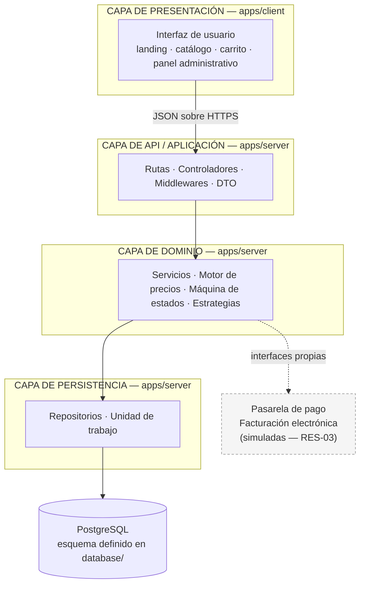
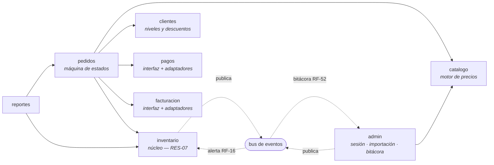
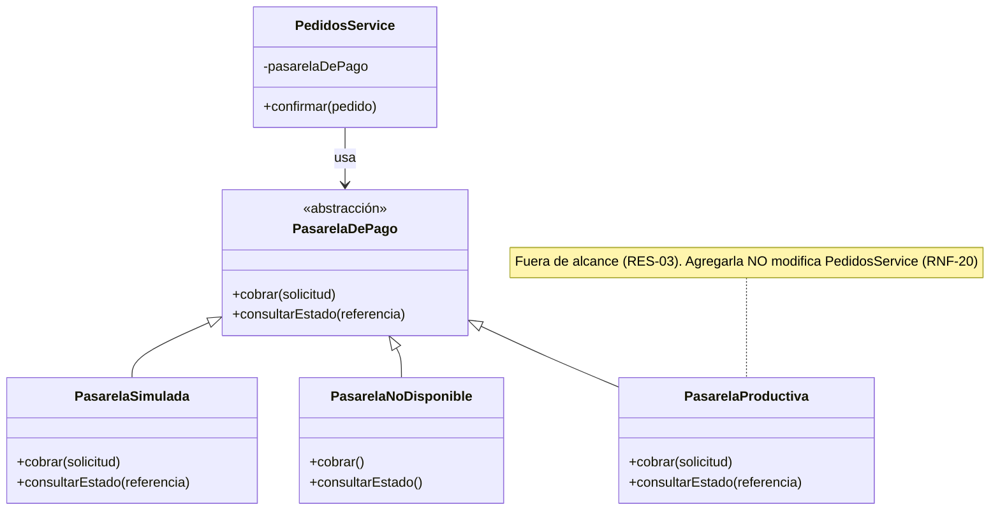
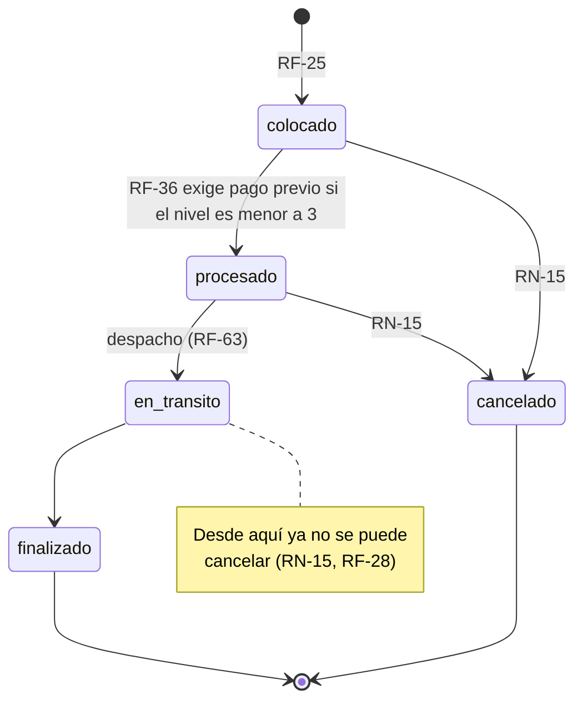
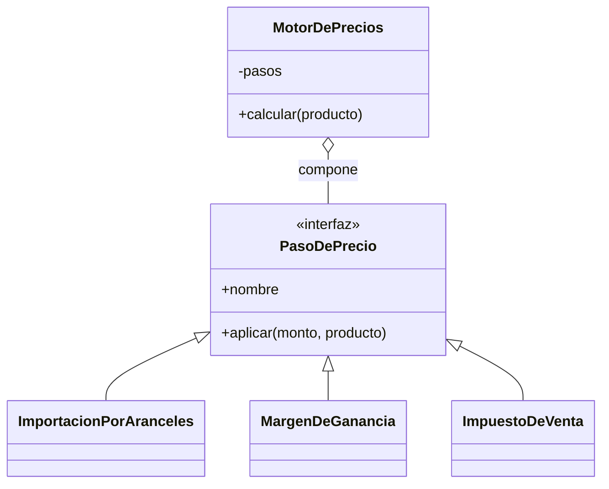
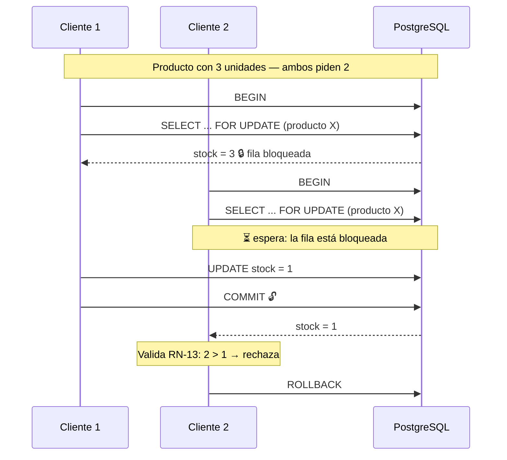
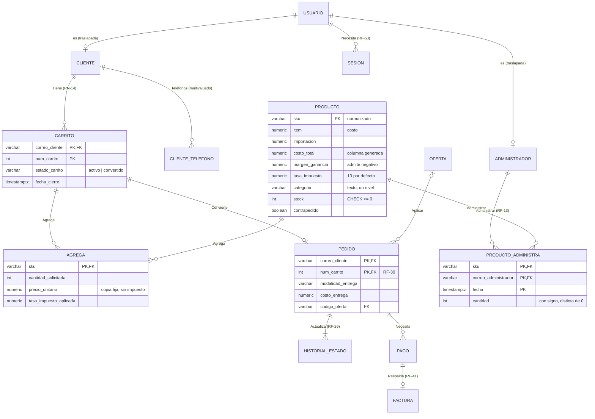

# Documento de Diseño de Software

**Proyecto:** DC Hobbies Cultura Geek Online — plataforma de comercio electrónico
**Equipo:** Twenty One CoPilots — Joaquín Rodríguez · Juan Loaiza · Agustín Soto · Jeferson Marín
**Cursos:** CI0126 Ingeniería de Software · CI0128 Proyecto Integrador Inge-Bases
**Documento base:** `documentos/requerimientos/sprint_0.pdf` (SRS PI-REQ-001 v3.1)
**Estado:** propuesta del equipo para revisión

| Versión | Fecha | Cambios |
|---|---|---|
| 1.0 | 25 de setiembre de 2026 | Arquitectura, patrones de diseño y análisis de concurrencia, acordados en la reunión de diseño |
| 1.1 | 26 de setiembre de 2026 | Diseño de la base de datos (§ 9), recorrido de un dato de extremo a extremo (§ 10), estructura del proyecto en `apps/` + `database/` (§ 11), decisiones DD-10 a DD-14 |
| 1.2 | 26 de setiembre de 2026 | Estados del pedido alineados con RF-26 (§ 6.4); umbral de alerta fijo según RN-04 (§ 15); § 9 actualizado con el esquema implementado en `database/` a partir de las herramientas del prototipo `kit-bd-21copilots_4`; decisiones DD-15 a DD-17 |
| 1.3 | 4 de octubre de 2026 | Alineado con el EER corregido del 30 de setiembre (§ 9, § 10, DD-13 a DD-17) y con lo implementado en el Sprint 1: servidor existente (§ 1, § 11), Template Method implementado (§ 6.6), candado sobre el stock del producto (§ 7.3), descuento por ofertas (§ 6.5), fórmula de precio validada (INC-05) |

> **Sobre la autoría de este documento.** Las ideas y las decisiones que aquí se
> registran son del equipo: los integrantes las expusieron, discutieron las
> alternativas y eligieron. Claude (Anthropic) actuó como redactor: ordenó lo discutido,
> lo contrastó con el SRS y con la materia del curso CI0136 Diseño de Software, y lo
> plasmó en este texto. Donde el documento dice "el equipo decidió", la decisión es de
> los integrantes; donde explica un patrón o su justificación teórica, es la síntesis
> que Claude hizo de esa discusión.

---

## Índice

1. [Propósito, alcance y cómo leer este documento](#1-propósito-alcance-y-cómo-leer-este-documento)
2. [Condicionantes del diseño](#2-condicionantes-del-diseño)
3. [Patrones de arquitectura](#3-patrones-de-arquitectura)
4. [Patrones de creación](#4-patrones-de-creación)
5. [Patrones estructurales](#5-patrones-estructurales)
6. [Patrones de comportamiento](#6-patrones-de-comportamiento)
7. [Análisis de concurrencia](#7-análisis-de-concurrencia)
8. [Patrones de paralelismo](#8-patrones-de-paralelismo)
9. [Diseño de la base de datos](#9-diseño-de-la-base-de-datos)
10. [Recorrido de un dato de extremo a extremo](#10-recorrido-de-un-dato-de-extremo-a-extremo)
11. [Estructura del proyecto](#11-estructura-del-proyecto)
12. [Equivalencias de nomenclatura](#12-equivalencias-de-nomenclatura)
13. [Trazabilidad requerimiento → patrón](#13-trazabilidad-requerimiento--patrón)
14. [Decisiones de diseño registradas](#14-decisiones-de-diseño-registradas)
15. [Convenciones para el equipo](#15-convenciones-para-el-equipo)
16. [Riesgos y puntos abiertos](#16-riesgos-y-puntos-abiertos)

---

## 1. Propósito, alcance y cómo leer este documento

Este documento recoge el diseño del sistema tal como el equipo lo acordó: el patrón
arquitectónico, los patrones de diseño que responden a cada problema concreto, el
análisis de concurrencia y paralelismo, y el diseño de la base de datos.

**Describe el sistema planeado, no solo el código existente.** Al cierre del Sprint 1
existen las tres partes: la interfaz (`apps/client/`), la base de datos (`database/`)
y el servidor (`apps/server/`). En el servidor están implementados el módulo
`catalogo` y, en `admin`, el inicio de sesión y la importación del Excel; los demás
módulos son esqueletos que se completan en los sprints siguientes siguiendo lo que
aquí se describe. Los nombres de archivos, clases y fragmentos de código de esos
módulos son la estructura prevista y sirven de guía; se ajustarán si la
implementación lo pide, y el ajuste se registrará en este documento.

Cada decisión se justifica contra un requerimiento del SRS, citado por su
identificador (RF-xx funcional, RN-xx regla de negocio, RNF-xx no funcional, RES-xx
restricción, INC-xx inconsistencia abierta).

En la discusión el equipo también revisó los patrones que **no** conviene aplicar, y
se documentan junto con el requerimiento que los justificaría si en algún sprint se
vuelven necesarios. El criterio compartido fue que un catálogo de patrones aplicados
sin motivo es tan malo como no aplicar ninguno: cada patrón presente en el código debe
responder a una fuerza real del problema.

**Leyenda de estados** usada en las tablas:

| Marca | Significado |
|---|---|
| ✅ Adoptado | Forma parte del diseño y se implementará así |
| ⚠️ Variante | Se adopta la intención del patrón con una forma distinta a la canónica, explicada en su sección |
| 📋 Planificado | Adoptado, pero su implementación corresponde a un sprint posterior |
| ❌ No adoptado | Evaluado y descartado, con el requerimiento que lo reactivaría |

---

## 2. Condicionantes del diseño

Antes de elegir patrones, el equipo fijó las fuerzas que los condicionan. Todas salen
del SRS o de decisiones previas del equipo:

| Condicionante | Origen | Consecuencia sobre el diseño |
|---|---|---|
| El inventario es único y compartido entre todos los canales | RES-07, RN-05 | Exige consistencia transaccional; descarta repartir el inventario en componentes separados |
| Pago y facturación son **placeholder** en esta versión | RES-03 | Exige aislarlos tras una interfaz propia (RNF-20) |
| El sistema debe operar aunque los placeholder no respondan | RNF-06 | Descarta que el flujo principal dependa de ellos |
| ~195 SKU y 50 usuarios concurrentes | RNF-02 | No hay presión de escala que justifique distribuir |
| Equipo de 4 personas con dedicación parcial | RES-02 | Penaliza toda infraestructura adicional que haya que operar |
| Una persona ajena debe poder desplegar con solo la documentación | RNF-21 | Penaliza los despliegues con múltiples componentes |
| La fórmula de precio se definió durante el desarrollo y puede volver a ajustarse | INC-05, [`formula-precio.md`](formula-precio.md) | Exige que el cálculo sea reconfigurable sin reescritura |
| Los descuentos serán editables por el administrador | RN-08, RN-09, aprobado #10 | Exige que el algoritmo de descuento sea intercambiable y que sus parámetros (las ofertas) vivan en datos |
| Los ajustes al modelo de datos del Sprint 0 deben ser mínimos y justificados | Instrucciones del Sprint 1 | La base de datos sigue el EER del equipo, corregido solo donde un requerimiento lo exige (§ 9) |
| Stack elegido por el equipo: React + Vite, Node.js + Express, PostgreSQL | `README.md` | Fija el modelo de ejecución (§ 7) y el gestor de base de datos (§ 9) |

---

## 3. Patrones de arquitectura

### 3.1 Evaluación de los cuatro candidatos

El equipo evaluó los cuatro patrones arquitectónicos vistos en CI0136:

| Patrón | Decisión | Fundamento |
|---|---|---|
| **Multicapa** | ✅ **Adoptado** como estructura principal | Separa responsabilidades, permite probar el dominio aislado y confina el SQL |
| **MVC** | ✅ Adoptado en su variante web (Model 2) | Organiza la relación entre la interfaz y el servidor |
| **Broker** | ❌ No adoptado | Resuelve transparencia de ubicación entre componentes distribuidos; el sistema no los tiene |
| **P2P** | ❌ No adoptado | Supone nodos simétricos; la relación navegador–servidor es asimétrica (Cliente-Servidor) |

### 3.2 Multicapa — arquitectura adoptada

El sistema se organiza en cuatro capas con dependencias en un solo sentido:



**Regla de dependencias.** Las flechas solo bajan. Un repositorio nunca importa un
servicio; un servicio nunca importa un controlador; la capa de dominio no conoce
Express ni el driver de PostgreSQL. La única flecha punteada corresponde a los
sistemas externos, donde la dependencia está **invertida**: el dominio define la
interfaz y la implementación la cumple (ver § 5.2).

**Criterio para verificar que las capas son reales.** El equipo acordó que las pruebas
unitarias del motor de precios (`modules/catalogo/precio/motor-de-precios.test.js`)
deben verificar RN-01 y RN-02 sin levantar servidor ni base de datos. Si el cálculo
terminara en el controlador, esa prueba sería imposible de escribir sin montar el
sistema completo; que se pueda escribir es la evidencia de que la separación existe.

**Variante adoptada: capas por módulo.** En lugar de tres carpetas globales
(`controllers/`, `services/`, `repositories/`), cada módulo de negocio repite las
capas internamente. Es el mismo patrón con distinta unidad de organización. El equipo
lo eligió por RES-02: con cuatro personas trabajando en paralelo, la división
horizontal obliga a tocar tres carpetas lejanas por cada funcionalidad y multiplica los
conflictos de integración. La misma idea se extiende a la base de datos, con un
esquema de PostgreSQL por módulo (§ 9.3).



`pedidos` es el módulo con más dependencias porque confirmar una compra toca precio,
existencias, nivel del cliente, cobro y factura. `admin` depende de `catalogo` porque
la importación del Excel guarda los productos a través de su fachada (§ 9.3). Los
módulos **no se llaman entre sí para notificar**: para eso publican un evento (ver
§ 6.2).

### 3.3 MVC — adoptado en su variante web

En la discusión se precisó que el sistema aplica **Model 2**, la variante web de MVC,
y no el MVC original de Smalltalk. La diferencia es relevante y conviene declararla:

| Rol | Realización en el sistema | Correspondencia con el MVC clásico |
|---|---|---|
| **Controlador** | `catalogo.controller.js`: recibe la petición, valida la entrada, delega y responde | Equivalente |
| **Modelo** | `catalogo.service.js` (reglas) + `catalogo.repository.js` (estado persistente) | Equivalente |
| **Vista** | La aplicación React de `apps/client/` | **Diferente** |

En el MVC clásico la vista **observa** al modelo y se actualiza cuando este cambia,
mediante el patrón Observer. Aquí la vista se ejecuta en otra máquina y no puede
observar nada: consulta por HTTP y recibe una representación (DTO). El vínculo
Observer entre modelo y vista no existe, y por eso la literatura llama a este esquema
Model 2 y no MVC propiamente dicho.

En la capa de presentación, el patrón que organiza los componentes no es MVC sino
**Contenedor/Presentacional**: los componentes presentacionales solo reciben datos y
los despliegan, y los contenedores resuelven de dónde vienen.

### 3.4 Broker — no adoptado

El patrón Broker introduce un intermediario que proporciona **transparencia de
ubicación**: un cliente invoca un servicio sin conocer en qué máquina se ejecuta, y el
broker se encarga de localizarlo, enrutar la invocación, serializar los parámetros y
devolver el resultado. Sus realizaciones canónicas son CORBA, RMI y los ORB.

El equipo lo descartó por cinco razones, en orden de peso:

1. **No hay componentes distribuidos que mediar.** El sistema es un proceso de
   servidor y una base de datos. Introducir un broker sería construir el intermediario
   y después buscarle a quién intermediar.
2. **Contradice RNF-06.** El requerimiento exige que el 100 % de las operaciones de
   inventario y de registro de ventas se complete aunque los componentes externos
   fallen. Un broker agrega un punto de falla en el camino crítico.
3. **Contradice RNF-21.** Una persona ajena al equipo debe poder desplegar el sistema
   siguiendo solo la documentación. Cada componente distribuido adicional multiplica
   la dificultad de esa tarea.
4. **No hay presión de escala.** RNF-02 dimensiona 50 usuarios concurrentes sobre
   ~195 SKU. Ese volumen no justifica el costo del desacople distribuido.
5. **El equipo no puede operarlo.** RES-02 fija cuatro personas con dedicación
   parcial; la infraestructura de un broker exige despliegue, monitoreo y depuración
   propios.

> **Precisión importante.** El desacople de pago y facturación descrito en § 5.2 **no
> es un Broker**. Un broker desacopla *ubicación*; una interfaz con adaptadores
> intercambiables desacopla *implementación*. En nomenclatura de patrones de diseño,
> eso es **Bridge + Adapter**, no un patrón arquitectónico distribuido.

### 3.5 P2P — no adoptado

El patrón Peer-to-Peer supone nodos simétricos, donde cada participante actúa como
cliente y como servidor. En este sistema la asimetría es total: el navegador consume y
nunca provee. El patrón de comunicación real es **Cliente-Servidor**, implícito en
toda la arquitectura.

---

## 4. Patrones de creación

| Patrón | Estado | Realización prevista |
|---|---|---|
| **Factory Method** | ✅ Adoptado | `modules/pagos/index.js` y `modules/facturacion/index.js` |
| **Abstract Factory** | ⚠️ Variante | `composicion.js` |
| **Builder** | ❌ No adoptado | Candidato: ensamblado del motor de precios |
| **Prototype** | ❌ No adoptado | Sin caso de uso |
| **Singleton** | ❌ Evitado deliberadamente | Ver justificación |

### 4.1 Factory Method

`crearPasarelaDePago(nombre)` traduce un valor de configuración a una instancia
concreta que cumple la interfaz de la pasarela. La forma acordada (ilustrativa):

```js
const ADAPTADORES = {
  simulada:        () => new PasarelaSimulada(),
  "no-disponible": () => new PasarelaNoDisponible(),
};
```

Es un **Factory Method parametrizado**: la decisión de qué construir se delega a una
tabla en vez de a una subclase, que es la forma canónica del libro. La intención se
conserva —quien pide la pasarela no conoce la clase concreta— y añadir la integración
productiva es agregar una entrada.

Esta fábrica es lo que hace verificable RNF-20: cambiar de implementación es cambiar
una variable de entorno.

### 4.2 Abstract Factory — intención presente, forma no canónica

`componerSistema(configuracion)` construye una **familia coherente** de objetos
relacionados —pool de conexiones, bus de eventos, adaptadores y módulos— garantizando
que todos pertenezcan a la misma configuración. Esa es exactamente la intención de
Abstract Factory.

Formalmente será una función, no una jerarquía de fábricas. Si se necesitara
formalizarlo, la refactorización es directa: `FabricaDeEntornoProductivo` y
`FabricaDeEntornoDePruebas` implementando la misma interfaz. El equipo no lo planteó
así porque con un solo entorno de producción la jerarquía no aporta.

### 4.3 Builder — no adoptado

El motor de precios se ensambla con un arreglo de pasos:

```js
new MotorDePrecios([
  new ImportacionPorAranceles(),
  new MargenDeGanancia(),
  new ImpuestoDeVenta(),
])
```

Es el candidato natural a Builder (`ConstructorDeMotor().conAranceles().conMargen()
.conImpuesto().construir()`). Con tres pasos, el arreglo expresa el orden de forma
más directa que una interfaz fluida. La decisión se revisa si el número de pasos crece
o si aparecen combinaciones inválidas que un Builder deba impedir.

### 4.4 Prototype — no adoptado

No existe en el dominio ningún objeto cuya construcción sea costosa y cuya
clonación resulte más barata. Aplicarlo sería inventarle un uso.

### 4.5 Singleton — evitado deliberadamente

El pool de conexiones es **una sola instancia, pero inyectada** desde la raíz de
composición; no se expone como `getInstance()` global.

La distinción es de diseño, no de estilo:

| | Singleton | Instancia única inyectada |
|---|---|---|
| Quién controla la instancia | La propia clase | La raíz de composición |
| ¿Se puede sustituir en pruebas? | No sin trucos | Sí, se pasa otra |
| Dependencia visible en la firma | No, queda oculta | Sí, explícita en el constructor |

Como el objetivo es que el dominio se pueda probar sin base de datos (§ 3.2), un
Singleton trabajaría en contra. **Instancia única no es sinónimo de patrón Singleton.**

---

## 5. Patrones estructurales

| Patrón | Estado | Realización o candidato |
|---|---|---|
| **Adapter** | ✅ Adoptado | Adaptadores de pago y facturación |
| **Bridge** | ✅ Adoptado | Separación entre la interfaz de pago y sus implementaciones |
| **Facade** | ✅ Adoptado | `index.js` de cada módulo |
| **Decorator** | ⚠️ Variante | Pipeline del motor de precios |
| **Composite** | ❌ No adoptado | Candidato: árbol de categorías |
| **Proxy** | ❌ No adoptado (reservado) | Candidato: caché del catálogo (RNF-01, RNF-02) |

### 5.1 Adapter

`PasarelaSimulada` y `FacturacionSimulada` traducen un sistema externo a la interfaz
que el sistema necesita. En esta versión adaptan un comportamiento simulado (RES-03);
cuando existan la pasarela real y la conexión con Hacienda, el nuevo adaptador
traducirá su API a la misma interfaz y ningún otro archivo cambiará.

El equipo acordó que `FacturacionSimulada` no devuelva un valor fijo: debe validar que
vengan los datos fiscales de la sociedad y la cédula del cliente antes de emitir. Así
la prueba de verificación de RNF-18 se ejecuta contra el placeholder y seguirá siendo
válida contra la integración real.

### 5.2 Bridge — la estructura completa del desacople

Es el nombre, en el catálogo del curso, de lo que otra literatura llama "puertos y
adaptadores": una **abstracción** y su **implementación** varían de forma
independiente.



El módulo de pedidos importa **únicamente la abstracción**. Cuál implementación se
usa lo decide la raíz de composición. Ese es el criterio práctico para verificar
RNF-20: si al sustituir la pasarela hubiera que modificar la lógica de pedidos, el
patrón está mal aplicado.

`PasarelaNoDisponible` merece mención aparte: en lugar de lanzar una excepción,
devuelve un resultado no aprobado y explícito. Es la realización de **Null Object**
—patrón que no pertenece a los 23 del GoF, sino a la literatura posterior— y es lo que
sostiene RNF-06: el pedido se registra, el inventario se actualiza y el cobro queda
pendiente. En la base de datos el pago se guarda con estado `pendiente`, porque el
`CHECK` de `pagos.pago` no tiene un estado `no_disponible` (§ 9.4). Qué número de
referencia lleva un pago cuando la pasarela no devuelve uno está por definir (ver
[`cambios-siguiente-sprint.md`](../requerimientos/cambios-siguiente-sprint.md)).

### 5.3 Facade

El `index.js` de cada módulo expone hacia afuera únicamente lo que el resto del
sistema necesita —las rutas ya ensambladas— y oculta el repositorio, el servicio, los
pasos de precio y el controlador. Reduce el acoplamiento entre módulos a un solo punto
de entrada.

### 5.4 Decorator — equivalente estructural

Los pasos del motor de precios comparten una interfaz común y se aplican en cadena
sobre el mismo dato, que es la estructura de Decorator. La diferencia con la forma
canónica: en Decorator cada objeto **envuelve** al anterior y mantiene una referencia
a él; aquí la composición es externa, mediante una reducción sobre la lista.

La variante corresponde a **Pipes & Filters** (patrón arquitectónico de la familia
POSA). El equipo la eligió porque produce, sin costo adicional, el desglose paso a
paso del cálculo:

```
costo → importación → margen → impuesto → precio final
```

Ese desglose es lo que permite verificar RNF-17 (comparar el cálculo del sistema
contra el cálculo manual) identificando **en cuál paso** divergen los números. Así se
cerró INC-05: el cálculo se comparó paso a paso contra el Excel del cliente
([`formula-precio.md`](formula-precio.md)).

### 5.5 Composite — no adoptado

Un árbol de categorías es el candidato evidente. No se aplica porque la categoría es
**un solo nivel**: un atributo de texto del producto (la "familia" de la hoja del
cliente), sin subcategorías (§ 9.4). Composite se justifica cuando la profundidad es
arbitraria y el cliente debe tratar igual a hojas y compuestos; con un nivel no hay
árbol que recorrer.

### 5.6 Proxy — no adoptado, candidato identificado

Es el patrón de reserva para los requerimientos de desempeño. RNF-01 exige que el
catálogo cargue en ≤ 3 s y RNF-02 que sostenga 50 usuarios concurrentes sobre ~195
SKU. Si las pruebas de carga no alcanzan el umbral, el equipo acordó que la primera
intervención sea un **proxy de caché**:

```
CatalogoService → CatalogoRepositoryConCache → CatalogoRepository → PostgreSQL
                  (misma interfaz, memoria intermedia)
```

Como implementa la misma interfaz que el repositorio real, entra sin modificar el
servicio ni el controlador. La estructura de capas es lo que hace que esta mejora
cueste un archivo. Es también la razón por la que el precio final no se guarda como
columna (§ 9.4): si hace falta velocidad, la respuesta es la caché, no desnormalizar.

---

## 6. Patrones de comportamiento

| Patrón | Estado | Realización o candidato |
|---|---|---|
| **Chain of Responsibility** | ✅ Adoptado | Cadena de middlewares |
| **Observer** | ✅ Adoptado | Bus de eventos de dominio |
| **Mediator** | ⚠️ Variante | Rol cumplido por el bus de eventos |
| **State** | ⚠️ Variante tabular | Estados del pedido |
| **Strategy** | ✅ Adoptado ×2 | Pasos de precio (implementado) y descuento por oferta (📋 planificado) |
| **Template Method** | ✅ Adoptado | Importación del Excel |
| **Command** | ❌ No adoptado | Candidato fuerte: ajustes de inventario |
| **Memento** | ❌ No adoptado | Sin caso real |
| **Visitor** | ❌ No adoptado | Costo mayor que el beneficio |

### 6.1 Chain of Responsibility

La cadena de middlewares procesa cada petición eslabón por eslabón; cada uno decide si
la atiende o la pasa al siguiente:

```
identificarUsuario → exigirSesion → exigirRol(ADMINISTRADOR) → controlador
                                                                    ↓
                                          rutaNoEncontrada → manejadorDeErrores
```

`identificarUsuario` se monta una sola vez en `app.js` para todas las peticiones: deja
al usuario de la cookie en la petición y nunca bloquea, porque el catálogo es público.
`exigirSesion` y `exigirRol` se agregan en cada ruta que los necesita. Qué rutas los
llevan está en [`matriz-permisos.md`](matriz-permisos.md) § 3.

Aplicaciones concretas:
- **RF-50**: `exigirSesion` corta la cadena si no hay sesión (401) y `exigirRol` si el
  rol no tiene permiso (403).
- **RNF-10**: `exigirRol` publica el evento `acceso_denegado` antes de cortar, para
  que el 100 % de los accesos no autorizados quede documentado. El middleware no sabe
  cómo se guarda la auditoría: eso le toca al observador de bitácora (§ 6.2).
- El manejador de errores es el último eslabón y el único que decide códigos HTTP,
  traduciendo errores de dominio a respuestas.

### 6.2 Observer

`BusDeEventos` ofrece `suscribir(evento, manejador)` y `publicar(evento, datos)`.
El módulo de inventario es el **sujeto**; la alerta de existencias bajas (RF-16) y la
bitácora de auditoría (RF-52) son los **observadores**.


El observador de alertas ya está registrado en `composicion.js`. El de bitácora es
📋 planificado: los eventos que debe registrar ya se publican, pero dónde se guarda la
bitácora está por definir (ver
[`cambios-siguiente-sprint.md`](../requerimientos/cambios-siguiente-sprint.md)).

Tres propiedades del diseño importan:

1. **El sujeto no conoce a sus observadores.** Agregar una notificación nueva no toca
   el código del inventario.
2. **Un observador que falla no interrumpe al sujeto.** Los errores de los
   suscriptores se capturan y se registran, nunca se propagan a quien publicó. Esto es
   lo que hace cumplir RNF-06 a nivel de código.
3. **Los eventos se publican después del `COMMIT`.** Si se publicaran antes y la
   transacción se revirtiera, la bitácora registraría un movimiento que nunca ocurrió
   (ver § 10.2).

### 6.3 Mediator — rol cumplido, mecánica de Observer

El mismo bus cumple el **rol** de Mediator en la arquitectura: inventario y admin no
se conocen entre sí y se comunican a través de él.

La distinción conceptual, que el equipo quiso dejar explícita: un Mediator canónico
**contiene la lógica de coordinación** entre colegas; el bus solo enruta por tipo de
evento, sin saber qué significa ninguno. Por mecánica es Observer
(publicación/suscripción); por posición en el diseño desempeña la función que en el
catálogo se le atribuye a Mediator.

### 6.4 State — variante tabular

Los estados son los que fija RF-26 (colocado, procesado, en tránsito, finalizado), más
el estado cancelado que introduce RF-28:



Las transiciones legales viven en una **tabla** dentro de un solo archivo del módulo
de pedidos, no repartidas en condicionales por todo el servicio. RN-15 —"cancelable
hasta antes del despacho"— se deriva de esa misma tabla, de modo que no puede quedar
desincronizada con las transiciones. La base de datos solo conoce **qué estados
existen** (un `CHECK` sobre `pedidos.historial_estado.estado`); **qué transiciones son
legales** es conocimiento exclusivo de esta tabla (§ 9.2). El pedido no guarda su
estado en una columna: el estado vigente es el último registro de su historial, y se
lee de la vista `reportes.v_estado_pedido`.

**Justificación de la variante.** La forma canónica del GoF define una clase por
estado y delega en ella el comportamiento del objeto. Hoy el estado del pedido no
determina *comportamiento distinto*, solo *qué transición se permite*: una clase por
estado sería ceremonia sin contenido. La decisión se revisa si aparece comportamiento
divergente —por ejemplo, si un pedido en tránsito calculara la reposición de forma
distinta a uno procesado (RN-17)—, y entonces la migración a la forma canónica es
directa porque el conocimiento ya está centralizado.

### 6.5 Strategy — dos aplicaciones

**a) Pasos del motor de precios.** Cada paso implementa la misma interfaz y es
intercambiable:



La fuerza que lo justifica es **INC-05**: la fórmula exacta estuvo en disputa hasta
que se validó contra el Excel del cliente ([`formula-precio.md`](formula-precio.md)), y
si vuelve a cambiar se reordena o se sustituye un paso sin reescribir el cálculo.
`MargenDeGanancia` no valida el signo del porcentaje, porque RN-02 permite el margen
negativo para liquidaciones. `ImpuestoDeVenta` toma la tasa de cada producto
(`catalogo.producto.tasa_impuesto`, 13 % por RES-06), de modo que un cambio de la
normativa se resuelve en datos y no en la clase.

**b) Descuento por oferta — planificado.** El descuento sale de las ofertas que
registra el administrador (`pedidos.oferta`, aprobado #10): cada una tiene vigencia
por fechas, porcentaje, monto mínimo de compra y nivel de fidelidad mínimo. La
estrategia de descuento recibe la oferta y el nivel del cliente y decide si aplica;
`SinDescuento` es el caso de un pedido sin oferta. Los parámetros viven en la tabla y
no en el código, así que el administrador los cambia sin pedir un cambio al sistema.

### 6.6 Template Method

La importación del Excel (RF-57, RF-58, RF-59) está implementada con este patrón.
`PlantillaDeImportacion` fija el esqueleto `parsear → prepararContexto → validarFila →
mapearFila → guardarFila` e `ImportacionDeExcel` redefine los pasos que dependen del
formato `.xlsx` (leer las celdas, encontrar los encabezados y validar cada fila).
Primero se valida el archivo completo y después las filas válidas se guardan en una
sola transacción. Los requerimientos que fija el esqueleto: las filas válidas se
importan aunque otras fallen, cada fila
rechazada va a un reporte descargable con su motivo, y reimportar el mismo archivo
actualiza en lugar de duplicar. Esto último se apoya en que el SKU normalizado es la
llave primaria del producto, lo que permite un `INSERT ... ON CONFLICT (sku)` directo
(§ 9.4).

La importación vive en el módulo `admin`, pero guarda los productos a través de la
fachada de `catalogo`, porque solo ese módulo escribe en su esquema (§ 9.3).

### 6.7 Command — no adoptado, candidato más fuerte

De los patrones que quedaron fuera, es el que el equipo identificó con mejor relación
costo/beneficio. Modelar cada ajuste de inventario como un objeto Command con
`ejecutar()` y `deshacer()` resolvería tres requerimientos con un solo mecanismo:

| Requerimiento | Cómo lo resolvería |
|---|---|
| RF-52 — bitácora de auditoría | La bitácora es la lista de comandos ejecutados, con sus parámetros |
| RF-28 / RN-15 — cancelar pedido y devolver unidades | La devolución es el `deshacer()` del comando de descuento |
| RF-20 — rechazar ajustes sin justificación | La validación vive en el comando, junto a los datos que valida |

No se incorporó en esta versión para no aumentar la carga conceptual del primer
sprint. Queda como la primera extensión recomendada del diseño.

### 6.8 Memento — no adoptado

El paralelo aparente es RN-06: el histórico de costos que no se sobrescribe. Pero
Memento captura el estado interno de un objeto **en memoria** para restaurarlo sin
violar su encapsulamiento; un histórico persistido es un registro de versiones en la
base de datos. Llamar Memento a un registro histórico sería forzar la
correspondencia.

### 6.9 Visitor — no adoptado

Requiere una jerarquía de objetos estable sobre la cual se agreguen operaciones
nuevas con frecuencia. Los reportes podrían plantearse así, pero en un lenguaje sin
tipado estático el patrón pierde su principal beneficio —la verificación en
compilación de que toda variante fue atendida— y conserva toda su ceremonia.

---

## 7. Análisis de concurrencia

### 7.1 Modelo de ejecución

El servidor (Node.js) se ejecuta sobre un **modelo monohilo con bucle de eventos**.
Esto cambia por completo el análisis respecto de un sistema multihilo: en el código de
aplicación no hay acceso concurrente a estructuras en memoria, y por lo tanto no hay
carreras que proteger con exclusión mutua dentro del proceso.

La carga del sistema es **ligada a entrada/salida** —el tiempo se va esperando a
PostgreSQL—, no ligada a CPU. El paralelismo de cómputo no es la herramienta adecuada
para este problema; el solapamiento de esperas sí.

| Patrón | Estado | Análisis |
|---|---|---|
| **Half-Sync/Half-Async** | ✅ Es el modelo del entorno | Ver § 7.2 |
| **Monitor Object** | ⚠️ Delegado al gestor de base de datos | Ver § 7.3 |
| **Active Object** | ❌ No adoptado | Candidato si la facturación real resulta lenta |
| **Leader/Followers** | ❌ No aplica | Requiere un pool de hilos que se turnen para aceptar conexiones |
| **Descomposición de datos** | ❌ No necesaria | El volumen (~195 SKU) no la justifica |

### 7.2 Half-Sync/Half-Async

El entorno de ejecución realiza exactamente las tres capas del patrón:

| Capa del patrón | Realización |
|---|---|
| **Asíncrona** | El bucle de eventos y la biblioteca de E/S del runtime, que atienden las notificaciones del sistema operativo |
| **De encolado** | La cola de callbacks y microtareas, que desacopla ambas capas |
| **Síncrona** | Los controladores y servicios del sistema, escritos de forma secuencial y legible |

Todo el código que escribirá el equipo vive en la **capa síncrona**. Por eso un
servicio puede escribirse como una secuencia de pasos legibles sin dejar de atender
decenas de peticiones simultáneas: la complejidad asíncrona la absorbe el runtime, no
el código de negocio.

Consecuencia de diseño: **ninguna operación del dominio debe bloquear la capa
síncrona** con cómputo prolongado, porque detendría el bucle de eventos para todas las
peticiones. Si aparece una operación así (procesar un Excel muy grande, generar un
reporte pesado), debe salir del camino de la petición.

### 7.3 Monitor Object delegado al gestor de base de datos

El escenario crítico es el que **RF-30 prueba explícitamente**: dos pedidos
confirmados de forma concurrente contra el mismo producto.

El recurso compartido no es un objeto en memoria: es la **columna `stock` de una fila
de `catalogo.producto`** (§ 9.4), y los competidores son dos transacciones de base de
datos. Un monitor implementado en el lenguaje no protegería nada, porque la carrera
ocurre por debajo.

Por eso el equipo delegó la protección a PostgreSQL mediante bloqueo pesimista de fila
(`SELECT ... FOR UPDATE`), que cumple exactamente la función del Monitor Object:
serializar el acceso al recurso compartido garantizando que solo un cliente opere
sobre él a la vez.



**Sin el bloqueo**, ambas transacciones leerían 3 unidades, ambas venderían 2, y el
inventario quedaría en -1: se violaría RN-13 y, con ella, RES-07 (el inventario es
único y debe ser exacto). Por eso todo descuento de existencias debe pasar por
`enTransaccion` tomando primero el candado. Como segunda línea de defensa, la tabla
tiene `CHECK (stock >= 0)`: si algún camino se saltara la validación, la base de
datos rechaza la escritura.

**Orden de bloqueo.** Un pedido con varios productos toma varios candados. Si dos
pedidos los tomaran en distinto orden, cada uno esperaría al otro indefinidamente
(*deadlock*). La regla acordada: los candados se toman **siempre en orden ascendente
de `sku`**, en una sola consulta (`SELECT ... FROM catalogo.producto WHERE sku =
ANY($1) ORDER BY sku FOR UPDATE`).

El costo aceptado: las operaciones sobre el **mismo producto** se serializan. Sobre
productos distintos no hay contención, de modo que el impacto en RNF-02 es
despreciable para el volumen previsto.

### 7.4 Active Object — no adoptado

El patrón desacopla la invocación de un método de su ejecución, encolando la petición
para que un hilo propio la atienda. La facturación simulada responde de inmediato y no
hay nada que desacoplar.

**Condición de revisión:** si la integración real con Hacienda resultara lenta o poco
confiable, `emitir()` debe convertirse en Active Object —encolar la solicitud y
responder al cliente sin esperar—, lo cual además refuerza RNF-06. La tabla de
facturas no necesita cambiar para eso: una factura solo se guarda cuando se emitió,
así que una solicitud encolada todavía no tiene fila.

### 7.5 Leader/Followers — no aplica

Es un patrón de pool de hilos que se turnan para aceptar y procesar conexiones. El
runtime no atiende las peticiones de ese modo. Lo más cercano sería escalar a varios
procesos del servidor, pero en ese esquema el reparto lo hace el sistema operativo, no
un protocolo de turnos entre hilos.

### 7.6 Descomposición de datos — no necesaria

Donde tendría sentido es la importación del Excel: partir las filas en bloques y
procesarlos concurrentemente. Con ~195 SKU (RNF-02) el archivo completo se procesa en
un solo lote sin acercarse a ningún límite. Si el catálogo creciera un orden de
magnitud, esta es la primera técnica a aplicar, junto con el procesamiento por flujo
para no cargar el archivo entero en memoria.

---

## 8. Patrones de paralelismo

| Patrón | Estado | Análisis |
|---|---|---|
| **Event-Based Coordination** | ✅ Adoptado en dos niveles | El bucle de eventos del runtime coordina el sistema completo; el bus de eventos coordina los módulos entre sí |
| **Parallel Task** | ⚠️ Concurrente, no paralelo | Ver precisión abajo |
| **Divide and Conquer** | ❌ No aplica | No hay un problema recursivamente divisible |
| **Geometric Decomposition** | ❌ No aplica | Es para datos en malla o matriz; el dominio no los tiene |
| **Recursive Data** | ❌ No aplica | Aplicaría a un árbol de categorías de profundidad arbitraria; el SRS fija dos niveles |

**Precisión sobre Parallel Task.** El bus de eventos lanza todos sus suscriptores a la
vez y espera a que todos terminen, y las consultas de un reporte podrían lanzarse de
la misma forma. En un proceso monohilo eso produce **concurrencia** —las esperas de
entrada/salida se solapan— y no **paralelismo** —no hay dos núcleos ejecutando cómputo
simultáneamente—. La distinción importa porque fija la expectativa correcta: lanzar a
la vez cinco consultas a la base mejora el tiempo total; lanzar a la vez cinco
cálculos de precio, no.

**Conclusión del análisis.** Que la mayor parte del catálogo de paralelismo no aplique
no es una omisión del diseño: es consecuencia directa del tipo de problema. Este es un
sistema de información ligado a entrada/salida, con ~195 SKU y 50 usuarios
concurrentes, no un sistema de cómputo intensivo. Los patrones de paralelismo
resuelven problemas que este sistema no tiene.

---

## 9. Diseño de la base de datos

El detalle tabla por tabla, el diccionario de datos y los cambios respecto al EER del
Sprint 0 están en [`modelo-datos.md`](modelo-datos.md). Esta sección fija los
criterios de diseño y cómo encajan con la arquitectura.

### 9.1 Papel de `database/` en la arquitectura

En el diagrama de § 3.2, la base de datos es el cilindro que está debajo de la capa de
persistencia. **No es una capa de código**: es el **contrato de datos** del que depende
el servidor. La carpeta `database/` contiene la definición de ese contrato (el
esquema, sus migraciones, sus datos semilla y sus pruebas); el motor PostgreSQL es un
proceso aparte que se levanta a partir de ella.

La dependencia va en un solo sentido, igual que las flechas de § 3.2:

```
apps/client  →  apps/server  →  database/
```

`database/` no sabe que existen Express ni React. `apps/server/` conoce el esquema en
un único lugar: los archivos `*.repository.js` de cada módulo.

### 9.2 Integridad en la base de datos, reglas en el dominio

Es la decisión central de este apartado y se deriva de § 3.2: si el dominio debe
poder probarse sin base de datos, las reglas de negocio no pueden vivir en la base de
datos.

> **La base de datos garantiza integridad. El dominio decide las reglas de negocio.**

| Va en la base de datos (restricciones) | Va en `apps/server/` (servicios) |
|---|---|
| `CHECK (stock >= 0)` en el producto: segunda línea de defensa de RN-13 | La validación de RN-13 y su mensaje de error |
| SKU normalizado como llave primaria: permite el upsert por SKU de RF-59 | El Template Method de la importación (§ 6.6) |
| Llaves foráneas, `NOT NULL`, tipos, valores permitidos | La máquina de estados del pedido (§ 6.4) |
| `CHECK (estado IN (...))`: **qué estados existen** | **Qué transiciones son legales** (RN-15) |
| `CHECK (margen_ganancia > -100)`, sin exigir signo (RN-02 lo permite negativo) | El motor de precios (§ 6.5) |
| Coherencia de un registro: un movimiento de mercancía tiene responsable y una cantidad distinta de cero | Quién puede registrar mercancía y cuándo |

**Triggers y procedimientos almacenados sin lógica de negocio.** Si RN-15 viviera en
un trigger, quedaría duplicada con la tabla de transiciones del código, no se podría
probar sin base de datos y rompería la convención de que cada regla cita su RN en el
código (§ 15). Los triggers se reservan para tareas técnicas y de integridad: mantener
la columna `fecha_actualizacion` y **rechazar la modificación de registros históricos**
(DD-16). Las **vistas** sí tienen un lugar natural: las consultas de `reportes` son
de solo lectura y no contienen reglas de dominio (ver § 16 sobre lo que pueda exigir
CI0128).

### 9.3 Un esquema de PostgreSQL por módulo

La variante "capas por módulo" de § 3.2 se extiende a la base de datos: cada módulo de
`apps/server/modules/` tiene su propio *schema* de PostgreSQL.

| Esquema | Módulo dueño | Contenido |
|---|---|---|
| `usuarios` | admin | usuarios y sus sesiones |
| `admin` | admin | el administrador (especialización de usuario) |
| `catalogo` | catalogo | productos, con su stock |
| `inventario` | inventario | registro de entradas y salidas de mercancía |
| `clientes` | clientes | clientes (especialización de usuario) y sus teléfonos |
| `pedidos` | pedidos | carritos, productos agregados, ofertas, pedidos e historial de estados |
| `pagos` | pagos | pagos |
| `facturacion` | facturacion | facturas |
| `reportes` | reportes | solo vistas de lectura |

`usuarios` es el único esquema que no lleva el nombre de su módulo: las cuentas y sus
sesiones son de todos los usuarios, clientes incluidos, pero quien las maneja es el
módulo `admin`, que es el del inicio de sesión.

**Regla de propiedad.** Solo el repositorio de un módulo escribe en su esquema; por
ejemplo, únicamente `inventario.repository.js` escribe en `inventario.*`. Si otro
módulo necesita cambiar algo de un esquema ajeno, lo pide a la fachada del módulo
dueño: la importación del Excel guarda los productos a través de `catalogo`, y el
servicio de inventario cambia el stock de un producto de la misma forma. Las llaves
foráneas entre esquemas sí se permiten: es una sola base de datos y RES-07 exige
consistencia transaccional entre módulos.

**Costo aceptado.** Hay que calificar los nombres (`catalogo.producto`) en el SQL de
los repositorios y en las migraciones.

### 9.4 Modelo de datos



Decisiones de modelado que salen del SRS y de este documento:

- **La base de datos sigue el EER del equipo** (DD-17). Cada diferencia con el EER del
  Sprint 0 responde a un requerimiento y está registrada en `modelo-datos.md` § 4.
- **Llaves naturales: correo y SKU.** El usuario se identifica por su correo y el
  producto por su SKU, como en el EER. Ambos se guardan normalizados (el correo en
  minúsculas, el SKU en mayúsculas, sin espacios en los extremos) y un `CHECK` lo
  garantiza. Si un correo cambia, `ON UPDATE CASCADE` lo propaga. El carrito, el
  pedido y su historial heredan la llave del cliente (`correo_cliente`,
  `num_carrito`).
- **Usuario se especializa en Administrador y Cliente**, de forma traslapada, como
  marca el EER: un mismo usuario puede estar en las dos tablas. El rol no es una
  columna: sale de la tabla en la que está el correo. RF-49 (una sola cuenta de
  administrador) se garantiza con un índice único. Todo cliente tiene cuenta, y su cédula es obligatoria y
  única porque la factura la exige (RN-18).
- **El precio final no se guarda en el producto** (DD-13). Se guardan sus entradas
  (costo, importación, margen y tasa de impuesto) y el motor de precios lo calcula.
  `costo_total` es una columna generada a partir del costo y la importación, así que
  nunca contradice a sus partes. Si el catálogo resultara lento, la respuesta prevista
  es el Proxy de caché (§ 5.6), no una columna.
- **La línea del carrito fija el precio** (DD-13). `pedidos.agrega` guarda el precio
  unitario sin impuesto y la tasa aplicada. Esas mismas filas son las líneas del
  pedido: un cambio posterior en el costo o el margen no altera el monto de un pedido
  ya hecho.
- **El pedido es entidad débil del carrito** (DD-15). Todo pedido nace de un carrito
  (relación «Convierte», 1 a 0..1) y hereda su llave (RF-30); sus líneas son las de
  `agrega`, sin duplicarlas en otra tabla. Las ventas de otros canales (RF-17, RN-05)
  también pasan por un carrito, de modo que los reportes cuentan todos los canales.
- **El stock vive en el producto.** `catalogo.producto.stock` es el saldo actual y la
  fila que se bloquea con `FOR UPDATE` (§ 7.3). `inventario.producto_administra` es el
  historial de entradas (cantidad positiva) y salidas (negativa) que registra el
  administrador, con su fecha (RF-13, RF-15).
- **Contrapedido.** Es un atributo del producto: si lo admite, se puede pedir aunque no
  haya stock, y el stock nunca queda negativo (RN-13, RF-23).
- **Los registros históricos son de solo inserción** (DD-16): el registro de mercancía
  y el historial de estados del pedido. Un trigger rechaza cualquier `UPDATE` o
  `DELETE` (RF-19), salvo los que produce un `ON UPDATE CASCADE`. Se prefirió al
  `REVOKE` porque en desarrollo la aplicación se conecta como dueña de las tablas, y a
  la dueña un `REVOKE` no la detiene.
- **El estado del pedido no se guarda en el pedido.** Es el último registro de
  `historial_estado`, y la vista `reportes.v_estado_pedido` lo expone. Así no hay dos
  fuentes para el mismo dato.
- **Los descuentos viven en una tabla** (DD-14). `pedidos.oferta` guarda la vigencia,
  el porcentaje, el monto mínimo y el nivel de fidelidad mínimo de cada oferta
  (aprobado #10), y un pedido puede aplicar una. Los valores fijados por el SRS que no
  son editables, como el umbral de alerta de 2 unidades (RN-04), viven en la
  configuración del servidor (§ 15, convención 5).
- **El nivel de fidelidad no se guarda**: se deriva de `num_compras`. Si cambia la
  escala, todos los clientes quedan en el nivel correcto sin recalcular nada.
- **Montos en dólares.** La tienda maneja dólares, y la hoja del cliente trae los
  costos en esa moneda.
- **El pago se registra contra un pedido.** Un pedido puede tener varios pagos, cada
  uno identificado por la referencia que devuelve la pasarela y con estado
  `pendiente`, `aprobado` o `rechazado`.
- **La factura respalda un pago.** Un pago tiene a lo sumo una factura (RF-41). Sus
  montos (subtotal, impuesto, descuento y total) se derivan de las líneas del pedido y
  no se guardan.
- **No existe ninguna columna para datos de tarjeta.** RNF-09 queda garantizado por
  la ausencia de la columna, no solo por el filtro del DTO.
- **Nombres en español y en `snake_case`**, iguales a los términos del SRS.

### 9.5 Herramientas, migraciones y datos semilla

Las herramientas de `database/` provienen del prototipo `kit-bd-21copilots_4`, que el
equipo construyó para familiarizarse con la base de datos antes de consolidar esta
arquitectura. El equipo decidió **conservar sus herramientas y que el esquema siga el
EER del equipo** (DD-17): las herramientas eran sólidas, y el modelo de datos ya
estaba acordado en el EER.

- **Migraciones SQL numeradas, solo hacia adelante** (DD-12). Una migración que ya se
  integró a la rama principal no se edita: cualquier cambio es una migración nueva. El
  script guarda un *checksum* de cada migración aplicada y se detiene si alguien edita
  una; también detecta dos migraciones con el mismo número, que es lo que pasa cuando
  dos ramas crean una a la vez.
- **Orden global, un módulo por archivo.** La numeración es global para respetar las
  dependencias entre llaves foráneas, y cada archivo se ocupa de un solo módulo, de
  modo que la organización por módulo se conserva.
- **Sin ORM.** El equipo prefirió SQL explícito: encaja con repositorios que escriben
  su propio SQL (§ 3.2) y con los objetivos de CI0128.
- **Un comando por tarea**, dentro de `database/`: `npm run db:up` levanta
  PostgreSQL 17 en Docker, `npm run db:reset` reconstruye todo desde cero,
  `npm run db:migrate` aplica lo pendiente, `npm run db:test` ejecuta las pruebas y
  `npm run db:cliente` reconstruye la base y carga el Excel real del cliente a través
  del servidor. Esto es lo que sostiene RNF-21.
- **Semillas de prueba.** `semillas/demo/` contiene usuarios, productos, mercancía y
  pedidos de ejemplo que cubren a propósito los casos del SRS. La carga real del
  catálogo no es una semilla: entra por la importación del Excel (RF-57).
- **Pruebas de restricciones.** `database/pruebas/` verifica con SQL que cada
  restricción rechaza lo que debe rechazar y acepta lo que debe aceptar, y que se
  cumplen los invariantes que cruzan varias tablas (por ejemplo, que todo pedido nace
  de un carrito convertido). Cada archivo corre en una transacción que se revierte,
  así que nunca deja datos.
- **DDL generado.** `npm run db:dump` produce `database/schema.sql`, el entregable
  "Script de BD" del curso, a partir de lo que realmente existe en la base de datos.

---

## 10. Recorrido de un dato de extremo a extremo

### 10.1 Lectura: ver el catálogo

```
database/migraciones/005_catalogo.sql
   │  (se aplica una vez; crea la tabla en PostgreSQL)
   ▼
PostgreSQL ── catalogo.producto
   ▲
   │  SQL parametrizado ($1, $2)
apps/server/
   configuracion.js       lee DB_HOST, DB_PORT, ... de apps/server/.env
   composicion.js         crea UN pool (§ 4.5) y lo inyecta en cada repositorio
   shared/db/             enTransaccion(): BEGIN / COMMIT / ROLLBACK (Unit of Work)
   catalogo.repository.js SELECT ... → filas snake_case a objetos camelCase (Data Mapper)
   catalogo.service.js    aplica el MotorDePrecios y la regla de visibilidad (RN-03); no conoce SQL
   catalogo.controller.js traduce HTTP ↔ dominio
   catalogo.dto.js        lista blanca: expone precioFinal, oculta costo y margen
   │
   │  JSON sobre HTTPS — GET /api/catalogo/productos
   ▼
apps/client/
   api/                   clienteHttp: el único lugar que habla con la red
   hooks/useCatalogo      maneja cargando / error / datos
   pages/catalog/         contenedor: Catalog.jsx usa el hook
   components/            presentacionales: reciben props y las muestran (product-card, ...)
```

El dato cambia de forma en cada frontera, y cada transformación tiene un único
responsable:

| Frontera | Forma del dato | Quién transforma |
|---|---|---|
| Base de datos → servidor | Fila en `snake_case` | El repositorio |
| Dentro del servidor | Objeto de dominio (con costo y margen) | El servicio |
| Servidor → red | DTO (sin costo ni margen) | `*.dto.js` |
| Red → pantalla | Props de React | El hook y el contenedor |

**Prueba de que las capas son reales:** si se renombra una columna, cambian dos
archivos, una migración nueva y el repositorio. El servicio, el controlador y el
cliente no se enteran.

### 10.2 Escritura: confirmar un pedido (RF-25, RF-30)

1. `PedidosService` toma el carrito activo del cliente. Los precios ya están fijados
   en sus líneas (`agrega`); el servicio decide con la estrategia de descuento (§ 6.5)
   si aplica una oferta, y abre `enTransaccion(...)`.
2. Se bloquean las filas de `catalogo.producto` de todos los SKU del carrito, en orden
   ascendente de `sku` (§ 7.3).
3. El servicio valida RN-13. Si el stock no alcanza, la línea solo se acepta si el
   producto admite contrapedido. Si falla, `ROLLBACK`. Si algún camino se saltara esta
   validación, el `CHECK (stock >= 0)` lo detiene igual.
4. En la misma transacción: `UPDATE` del stock por la parte disponible, el carrito
   pasa a `convertido` con su `fecha_cierre`, `INSERT` del pedido con su modalidad de
   entrega y su oferta, e `INSERT` en `historial_estado` del estado `colocado`
   con su fecha. Luego `COMMIT`.
5. **Después** del `COMMIT` se publican `PEDIDO_CONFIRMADO` y `MOVIMIENTO_REGISTRADO`
   en el bus; la alerta (RF-16) y la bitácora (RF-52) hacen su parte (§ 6.2).
6. El cobro y la factura pasan por sus interfaces (§ 5.2). El pago se registra contra
   el pedido ya creado; si la pasarela o la facturación fallan, el pedido ya está
   registrado y queda con el pago pendiente (RNF-06).

---

## 11. Estructura del proyecto

El repositorio se organiza en tres partes, y las tres ya existen.

```
21CoPilots_PIBasesIngesoft/
├── apps/
│   ├── client/                      CAPA DE PRESENTACIÓN — React 19 + Vite
│   └── server/                      CAPAS DE API, DOMINIO Y PERSISTENCIA — Node.js + Express
├── database/                        CONTRATO DE DATOS — PostgreSQL 17, autocontenido
└── documentos/                      Requerimientos, diseño, entrevistas, sprints
```

Cada parte es autocontenida: tiene su propio `package.json` y, cuando lo necesita, su
propio `.env`.

### 11.1 `apps/client/`

```
apps/client/
├── index.html                   Cascarón con <div id="root">
├── vite.config.js               Proxy de /api al servidor en desarrollo
└── src/
    ├── main.jsx                 Montaje de React
    ├── App.jsx                  Proveedores + mapa de rutas (el panel va detrás de AdminRoute)
    ├── routes.js                Funciones que arman las rutas del catálogo y de la ficha
    ├── estilos/                 Sistema de diseño: tokens · base · componentes
    ├── components/              Presentacionales, una carpeta por componente
    │                            (header, footer, product-card, product-table, product-form, ...)
    ├── pages/                   Una por ruta; son los contenedores
    │                            (home, catalog, product-detail, access, products)
    ├── hooks/                   useCatalogo · useProducto · useCategorias · useSesion · ...
    ├── api/                     clienteHttp + endpoints por módulo
    └── context/                 Estado compartido: la sesión del usuario
```

En el frontend, la separación equivalente a las capas del servidor es
**Contenedor/Presentacional** (§ 3.3): `components/` no conoce el origen de los datos,
`pages/` resuelve los datos con los hooks, y `api/` es el único lugar que habla con la
red. La regla verificable en revisión de código: **ningún componente de `components/`
importa de `api/`**. Cuando se implemente el carrito, se persiste en la base de datos
(RF-24) y el contexto de React solo mantiene la copia que se muestra.

### 11.2 `apps/server/`

```
apps/server/
├── server.js                    Arranque del proceso
├── app.js                       CAPA DE API: cadena de middlewares y rutas
├── composicion.js               Raíz de composición (Abstract Factory en intención)
├── configuracion.js             Único lector de variables de entorno
├── scripts/                     Generador de la plantilla de importación
├── shared/
│   ├── db/                      Pool · Unit of Work
│   ├── eventos/                 Observer: bus y catálogo de eventos
│   ├── errores/                 Errores de dominio (sin conocimiento de HTTP)
│   └── http/                    Chain of Responsibility: middlewares
└── modules/
    ├── catalogo/                Primer módulo implementado; sirve de plantilla para los demás
    │   └── precio/              Strategy compuesta (Pipes & Filters)
    ├── admin/                   Sesión e importación implementadas + observador de bitácora
    │   ├── importacion/         Template Method
    │   └── seguridad/           Hash de contraseñas y tokens de sesión
    ├── inventario/              Núcleo (RES-07)
    │   └── suscriptores/        Observador de alertas
    ├── pedidos/
    │   └── estados/             State (máquina de estados)
    ├── clientes/                Strategy de descuento
    ├── pagos/                   Bridge: interfaz + Adapter + Null Object
    │   └── adaptadores/
    ├── facturacion/             Bridge: interfaz + Adapter + Null Object
    │   └── adaptadores/
    └── reportes/                Consultas de lectura sobre las vistas de reportes
```

El equipo acordó implementar `catalogo` primero, completo en todas sus capas, para que
sirva de referencia al resto. Cada módulo de negocio repite internamente la misma
disposición, con sus pruebas (`*.test.js`) junto al archivo que prueban:

```
modules/<modulo>/
├── <modulo>.routes.js       Rutas
├── <modulo>.controller.js   Capa de API: traduce HTTP ↔ dominio
├── <modulo>.service.js      Capa de dominio: las reglas
├── <modulo>.repository.js   Capa de persistencia: el SQL (único que conoce el esquema)
├── <modulo>.dto.js          Qué sale por la API (lista blanca de campos)
└── index.js                 Facade del módulo
```

`pagos` y `facturacion` no siguen esta disposición porque no tienen rutas: solo la
interfaz (`*.port.js`), sus adaptadores y un `index.js` con la fábrica (§ 4.1).

### 11.3 `database/`

```
database/
├── README.md                    Cómo levantar, cambiar y probar la base de datos (RNF-21)
├── guia.md                      Guía rápida para levantar la base de datos local
├── package.json                 Comandos npm run db:* y dependencias (pg, dotenv)
├── docker-compose.yml           PostgreSQL 17 para desarrollo
├── .env.example                 Plantilla de variables; el .env real no se sube
├── migraciones/                 Fuente de verdad del esquema; en orden, sin editar después
│   ├── 001_esquemas_y_utilidades.sql   Esquemas por módulo y triggers técnicos
│   ├── 002_usuarios.sql
│   ├── 003_admin.sql
│   ├── 004_clientes.sql
│   ├── 005_catalogo.sql
│   ├── 006_inventario.sql
│   ├── 007_pedidos.sql
│   ├── 008_pagos_facturacion.sql
│   └── 009_reportes.sql                Vistas de solo lectura
├── semillas/
│   └── demo/                    Datos de prueba para desarrollo y evidencias
├── pruebas/                     SQL que verifica restricciones e invariantes (npm run db:test)
├── scripts/                     migrate · seed · reset · probar · dump · new-migration · cargar-cliente
└── schema.sql                   DDL completo, GENERADO con npm run db:dump (entregable)
```

La numeración de las migraciones sigue las dependencias entre llaves foráneas:
`usuarios` va primero porque administrador y cliente lo referencian, `inventario`
después de `admin` y `catalogo` porque referencia a ambos, y `pedidos` después de
`clientes` y `catalogo`.

---

## 12. Equivalencias de nomenclatura

El código y la literatura de referencia usan nombres provenientes de varios catálogos.
Esta tabla los traduce para evitar ambigüedades en la revisión:

| Nombre en el código / literatura | Catálogo de origen | Equivalente en el catálogo del curso |
|---|---|---|
| Puerto / adaptador, arquitectura hexagonal | Cockburn | **Bridge + Adapter** con inversión de dependencias |
| Pipes & Filters | POSA (Buschmann) | Cadena de **Decorator** / **Strategy** compuesta |
| Repository | PoEAA (Fowler) | Sin equivalente; patrón de arquitectura de aplicación |
| Unit of Work | PoEAA (Fowler) | Sin equivalente; gestiona la transacción |
| DTO / Data Mapper | PoEAA (Fowler) | Sin equivalente |
| Null Object | Woolf | Caso degenerado de **Strategy** |
| Composition Root | Seemann | Cercano a **Abstract Factory** en intención |
| Model 2 | Literatura web | Variante de **MVC** |
| Bus de eventos | — | **Observer** por mecánica, **Mediator** por rol |
| Bloqueo pesimista de fila | Gestores de bases de datos | **Monitor Object** delegado |

---

## 13. Trazabilidad requerimiento → patrón

| Requerimiento | Exigencia | Patrón o mecanismo que la satisface |
|---|---|---|
| RNF-20 | Los placeholder deben estar aislados tras una interfaz propia | **Bridge + Adapter** |
| RNF-06 | Las operaciones deben completarse aunque los placeholder fallen | **Null Object** + aislamiento de fallos en el Observer + pago registrado como `pendiente` |
| RES-03 | Pago y facturación son simulados | **Adapter** + **Factory Method** |
| RN-01, INC-05 | Fórmula de precio configurable | **Strategy** compuesta (Pipes & Filters); precio no persistido; `costo_total` como columna generada |
| RN-02 | Margen negativo permitido | **Strategy** sin validación de signo; el `CHECK` solo exige que sea mayor que −100 |
| RN-08, RN-09, aprobado #10 | Descuentos editables por el administrador | **Strategy** parametrizada con las ofertas de `pedidos.oferta` |
| RF-26, RF-27 | Estados del pedido y su visibilidad | **State** (variante tabular) + `pedidos.historial_estado` + `reportes.v_estado_pedido` |
| RN-15, RF-28 | Cancelable solo antes del despacho | **State**: derivado de la tabla de transiciones |
| RF-16, RN-04 | Alerta de existencias bajas, umbral fijo | **Observer** + umbral en configuración |
| RF-52, RNF-10 | Bitácora de operaciones sensibles y accesos denegados | **Observer**: `exigirRol` publica `acceso_denegado`; dónde se guarda, ver [`cambios-siguiente-sprint.md`](../requerimientos/cambios-siguiente-sprint.md) |
| RF-50, RF-49 | Roles y una única cuenta de administrador | **Chain of Responsibility** + especialización de usuario + índice único |
| RF-53 | Sesión con vencimiento | Cookie `HttpOnly` + `usuarios.sesion` con el hash del token |
| RF-25, RF-30 | Confirmación de pedido bajo concurrencia | **Unit of Work** + **Monitor Object** delegado al SGBD |
| RES-07, RN-13 | Inventario único, exacto y sin negativos | Bloqueo pesimista de la fila del producto + `CHECK (stock >= 0)` |
| RF-13, RF-15, RF-19 | Entradas y salidas registradas y no modificables | `inventario.producto_administra` con responsable y fecha, y trigger de solo inserción |
| RF-17, RN-05 | Ventas de otros canales en el mismo inventario | Pedido como entidad débil del carrito: toda venta pasa por un carrito y descuenta el mismo stock |
| RF-57, RF-58, RF-59 | Importación del Excel | **Template Method** + SKU normalizado como llave primaria |
| RN-06, RF-14, RF-20, RF-38 | Histórico de costos, motivo de los ajustes y aceptación de términos | Sin representación en el modelo todavía, ver [`cambios-siguiente-sprint.md`](../requerimientos/cambios-siguiente-sprint.md) |
| RNF-09 | Ningún dato de tarjeta almacenado | Ausencia de la columna en el esquema + **DTO** con lista blanca |
| RNF-01, RNF-02 | Desempeño del catálogo | **Proxy** de caché (reservado) |
| RNF-19 | Mantenibilidad | **Multicapa** + capas por módulo + esquema por módulo |
| RNF-21 | Despliegue por una persona ajena | `npm run db:up` + `npm run db:reset` + `database/README.md` |
| RNF-12, RNF-15 | Interfaz responsiva y consistente | **Contenedor/Presentacional** |

---

## 14. Decisiones de diseño registradas

| ID | Decisión | Alternativa descartada | Consecuencia asumida |
|---|---|---|---|
| DD-01 | Arquitectura **Multicapa** con capas por módulo | Capas globales por tipo de archivo | Requiere disciplina: el dominio no puede importar Express ni el driver de base de datos |
| DD-02 | Descartar **Broker** y **P2P** | Arquitectura distribuida | Si el sistema se distribuyera, el bus de eventos es la costura por donde entraría el intermediario |
| DD-03 | **Bridge + Adapter** solo en el borde externo | Aplicarlo a todos los módulos | Los módulos que solo hablan con PostgreSQL no tienen interfaz duplicada |
| DD-04 | Bus de eventos **en memoria** | Cola de mensajes externa | Desacople sin infraestructura; los eventos no sobreviven a un reinicio del proceso |
| DD-05 | **Strategy** compuesta para el precio | Fórmula escrita directamente en el servicio o en una vista SQL | Si la fórmula cambia, se reordenan o se sustituyen pasos |
| DD-06 | **State** en variante tabular | Una clase por estado | Se migra a la forma canónica cuando el estado determine comportamiento, no solo transiciones |
| DD-07 | **Monitor Object** delegado al gestor de base de datos | Control de concurrencia en la aplicación | Las operaciones sobre un mismo producto se serializan; los candados se toman en orden de `sku` |
| DD-08 | Evitar **Singleton**; instancia única inyectada | `getInstance()` global | Las dependencias quedan explícitas y sustituibles en pruebas |
| DD-09 | **Command** documentado pero no implementado | Implementarlo desde el sprint 1 | Primera extensión recomendada; mientras tanto la bitácora se resuelve con Observer |
| DD-10 | Integridad en la base de datos, reglas de negocio en el dominio | Triggers y procedimientos con lógica de negocio | Algunas reglas tienen doble defensa (servicio + `CHECK`); los triggers quedan para tareas técnicas |
| DD-11 | Un **esquema de PostgreSQL por módulo** | Un solo esquema plano | Nombres calificados en el SQL; cada esquema tiene un único módulo que escribe en él |
| DD-12 | **Migraciones SQL versionadas**, solo hacia adelante, sin ORM | ORM con esquema generado | Más SQL escrito a mano; control total del esquema y alineación con CI0128 |
| DD-13 | Persistir las **entradas del precio**, no el precio final; fijar el precio sin impuesto y la tasa en la línea del carrito (`agrega`) | Guardar el precio calculado en el producto | El catálogo calcula en cada lectura; el desempeño se resuelve con el Proxy de caché si hace falta |
| DD-14 | Descuentos editables por el administrador **en tablas** (`pedidos.oferta`); valores fijos por ley o por el SRS en la configuración del servidor o como valor por defecto de la columna | Todo en variables de entorno | El repositorio de `pedidos` carga la oferta y la inyecta en la estrategia de descuento |
| DD-15 | **Pedido como entidad débil del carrito**: hereda su llave y sus líneas son las de `agrega` | Pedido independiente, con identificador y líneas propias | No se duplican las líneas; las ventas de otros canales también pasan por un carrito |
| DD-16 | **Registros históricos de solo inserción**, protegidos con trigger | `REVOKE` de permisos, o confiar en el código | Corregir un registro de mercancía se hace con otro de signo contrario, nunca editando el original |
| DD-17 | **Conservar las herramientas del prototipo** `kit-bd-21copilots_4` y que el **esquema siga el EER del equipo**, con ajustes mínimos y justificados | Adoptar el esquema del prototipo, o rediseñar el modelo | Se reutiliza el trabajo de herramientas; cada diferencia con el EER del Sprint 0 queda registrada en `modelo-datos.md` § 4 |

---

## 15. Convenciones para el equipo

1. **La capa de dominio no importa Express ni el driver de base de datos.** Si un
   `service.js` necesita el objeto de la petición o escribe SQL, la lógica está en la
   capa equivocada.
2. **Ningún adaptador concreto se importa fuera de `composicion.js`.** Es la
   verificación práctica de RNF-20 durante la revisión de código.
3. **Todo movimiento de existencias pasa por el servicio de inventario**, dentro de
   una transacción, tomando el candado de las filas de `catalogo.producto` en orden de
   `sku` (RES-07, RF-15, RF-30). Las entradas y salidas que hace el administrador
   quedan además en `inventario.producto_administra`.
4. **Notificar es publicar un evento**, no invocar al otro módulo, y se publica
   después del `COMMIT`.
5. **Ningún valor de negocio queda escrito en el código.** Los que el administrador
   puede editar (las ofertas, con su porcentaje y monto mínimo) viven en tablas; la
   tasa de impuesto de 13 % (RES-06) se guarda en cada producto; los fijados por el SRS
   (umbral de alerta de 2 unidades por RN-04) y los de infraestructura (conexión,
   puerto, adaptador de pago) viven en la configuración, leída solo por
   `configuracion.js`.
6. **Nomenclatura en español, igual a la del SRS** (`contrapedido`, `margen`,
   `bitacora`): el mismo término en el requerimiento, en el código, en la base de datos
   y en la conversación con el cliente. En la base de datos, en `snake_case` y sin
   tildes.
7. **Cada regla implementada cita su RN o RF en un comentario**, para que la
   trazabilidad sea verificable en la revisión de código.
8. **Solo el repositorio de un módulo escribe en su esquema**, y ninguna migración
   integrada a la rama principal se edita: se agrega una nueva, con su fila en
   `modelo-datos.md` y, si aplica, su prueba en `database/pruebas/`.

---

## 16. Riesgos y puntos abiertos

Esta tabla registra los riesgos del diseño y cómo los mitiga. Las decisiones que
siguen abiertas, con su detalle, están en [`cambios-siguiente-sprint.md`](../requerimientos/cambios-siguiente-sprint.md).

| Riesgo o punto abierto | Origen | Mitigación prevista en el diseño |
|---|---|---|
| La fórmula de precio puede volver a cambiar | INC-05, [`formula-precio.md`](formula-precio.md) | Strategy compuesta: se reordenan o sustituyen pasos; el precio no está persistido |
| Los porcentajes de descuento están en conflicto | RN-09, RN-10, RN-11 marcadas "en conflicto" | Los descuentos viven en `pedidos.oferta`, no en el código |
| Las tarifas de envío no están definidas | RN-16, DEP-07, aprobado #11 | Strategy de tarifa con tabla configurable |
| El desempeño del catálogo no se ha medido | RNF-01, RNF-02 | Proxy de caché reservado como primera intervención |
| Los eventos se pierden si el proceso se reinicia | DD-04 | Aceptado: ninguna regla de negocio depende hoy de su persistencia |
| Dos integrantes crean una migración con el mismo número | DD-12, RES-02 | El script lo detecta y se detiene; quien no ha integrado su rama renumera la suya |
| CI0128 podría exigir procedimientos almacenados o triggers | Evaluación del curso | Confirmar con el profesor; de ser necesario, ubicarlos en `reportes` o en tareas técnicas, sin reglas de negocio (DD-10) |
| Requerimientos sin representación en el modelo: bitácora, histórico de costos, motivo de los ajustes y aceptación de términos | RF-52, RN-06, RF-14, RF-20, RF-38 | Cada uno se agrega con una migración nueva y su fila en `modelo-datos.md` § 4 (DD-12) |
| Cuentas para empleados, aprobadas por el cliente | `documentos/entrevistas/e1-24-9-2026.md`, punto 6 | El rol sale de una tabla de especialización: se agrega la del empleado en una migración nueva y `exigirRol` no cambia. RF-49 y el registro de mercancía (que apunta a `admin.administrador`) se revisan en ese momento |
| No está definido qué hacer si un cliente no da su cédula | RF-33 ("comportamiento definido") | La base de datos la exige porque la factura la necesita (RN-18); confirmar con el cliente |
| Datos fiscales de la sociedad y escala de niveles sin lugar en el modelo | RN-08, RN-18 | Los usan los descuentos y la facturación, que todavía no se implementan; de dónde salen se decide antes de implementarlos |
