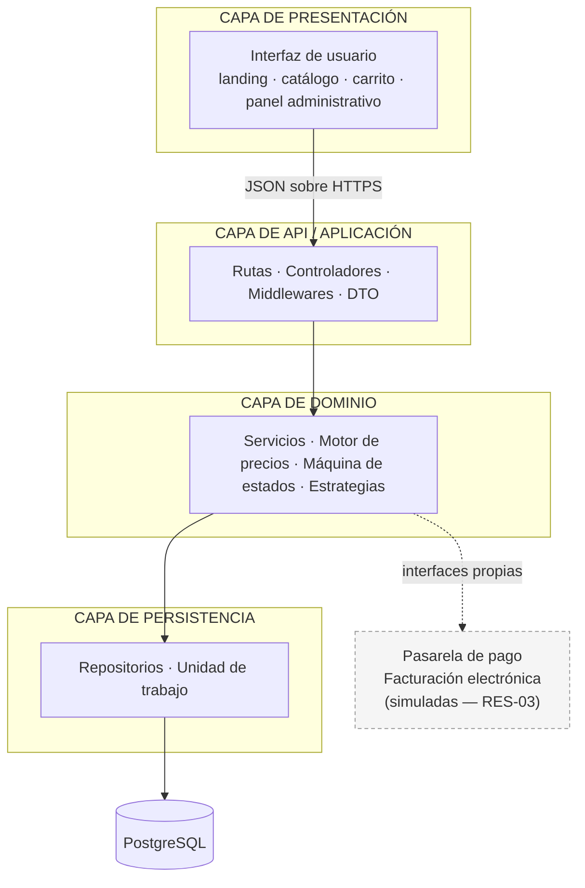
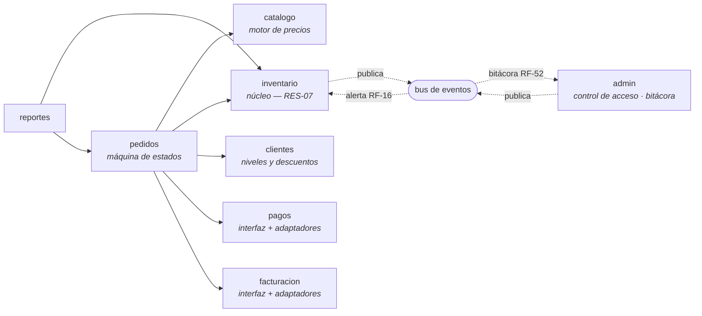
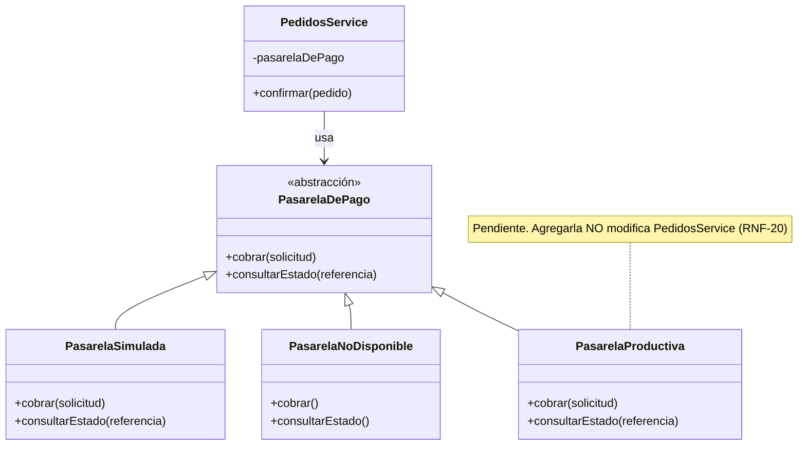
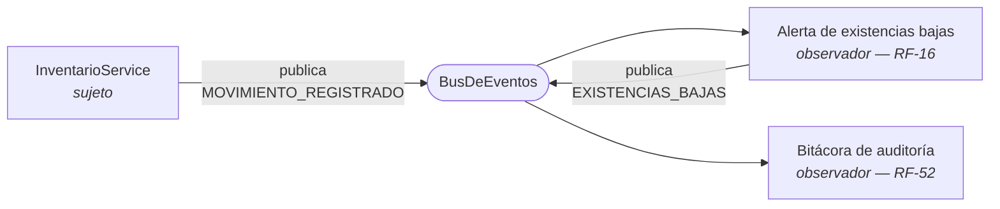
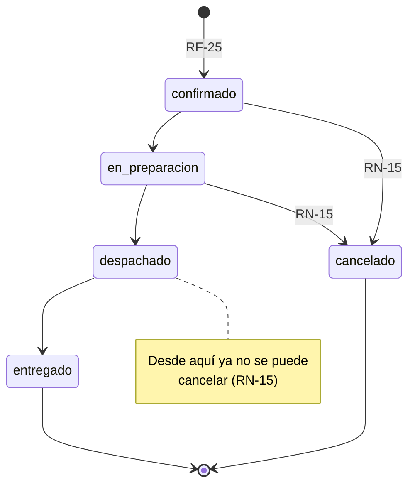
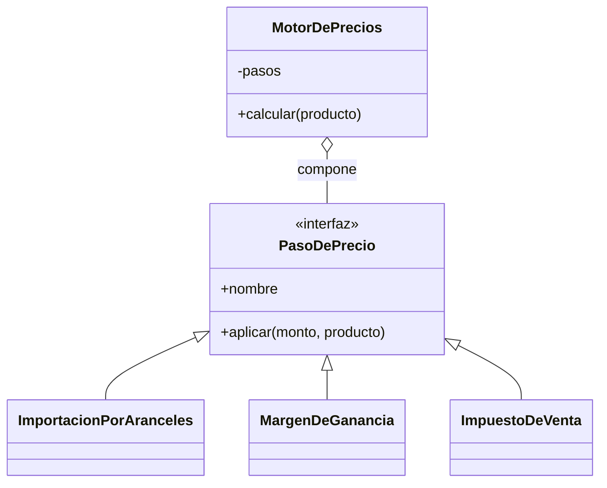
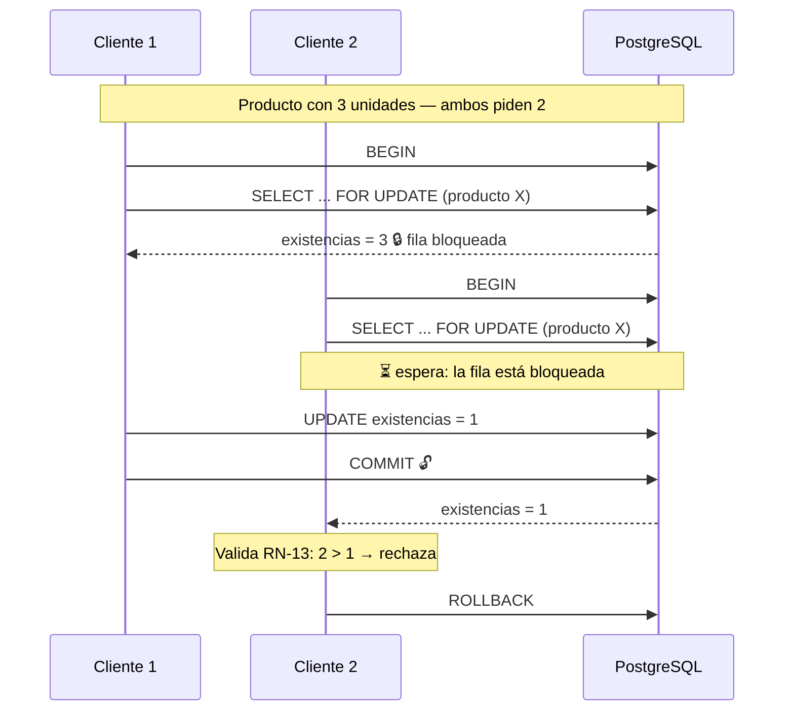

# Documento de Diseño de Software

**Proyecto:** DC Hobbies Cultura Geek Online — plataforma de comercio electrónico
**Equipo:** Twenty One CoPilots
**Cursos:** CI0126 Ingeniería de Software · CI0128 Proyecto Integrador Inge-Bases
**Documento base:** `Documentos/sprints/sprint0/sprint_0.pdf` (SRS PI-REQ-001 v3.1)
**Fecha:** 25 de setiembre de 2026
**Estado:** propuesta del equipo para revisión
**Qué es esto:** esquema arquitectonico decidido por el equipo en esta reunión, revisado y sintetizado con ayuda de Claude, con base en la materia aprendida en el curso CI0136 Diseño de Software

---

## Índice

1. [Propósito y alcance](#1-propósito-y-alcance)
2. [Condicionantes del diseño](#2-condicionantes-del-diseño)
3. [Patrones de arquitectura](#3-patrones-de-arquitectura)
4. [Patrones de creación](#4-patrones-de-creación)
5. [Patrones estructurales](#5-patrones-estructurales)
6. [Patrones de comportamiento](#6-patrones-de-comportamiento)
7. [Análisis de concurrencia](#7-análisis-de-concurrencia)
8. [Patrones de paralelismo](#8-patrones-de-paralelismo)
9. [Equivalencias de nomenclatura](#9-equivalencias-de-nomenclatura)
10. [Trazabilidad requerimiento → patrón](#10-trazabilidad-requerimiento--patrón)
11. [Decisiones de diseño registradas](#11-decisiones-de-diseño-registradas)
12. [Estructura del código](#12-estructura-del-código)
13. [Convenciones para el equipo](#13-convenciones-para-el-equipo)
14. [Riesgos y puntos abiertos](#14-riesgos-y-puntos-abiertos)

---

## 1. Propósito y alcance

Este documento define el diseño del sistema: el patrón arquitectónico adoptado, los
patrones de diseño aplicados a cada problema concreto, y el análisis de concurrencia
y paralelismo.

Cada decisión se justifica contra un requerimiento del SRS, referenciado por su
identificador (RF-xx funcional, RN-xx regla de negocio, RNF-xx no funcional, RES-xx
restricción, INC-xx inconsistencia abierta).

Los patrones que **no** se aplicaron también se documentan, junto con el requerimiento
que los justificaría si en algún sprint se vuelven necesarios. Un catálogo de patrones
aplicados sin criterio es tan malo como no aplicar ninguno: el objetivo es que cada
patrón presente en el código responda a una fuerza real del problema.

---

## 2. Condicionantes del diseño

Antes de elegir patrones conviene fijar las fuerzas que los condicionan. Todas salen
del SRS:

| Condicionante | Origen | Consecuencia sobre el diseño |
|---|---|---|
| El inventario es único y compartido entre todos los canales | RES-07, RN-05 | Exige consistencia transaccional; descarta repartir el inventario en componentes separados |
| Pago y facturación son **placeholder** en esta versión | RES-03 | Exige aislarlos tras una interfaz propia (RNF-20) |
| El sistema debe operar aunque los placeholder no respondan | RNF-06 | Descarta que el flujo principal dependa de ellos |
| ~195 SKU y 50 usuarios concurrentes | RNF-02 | No hay presión de escala que justifique distribuir |
| Equipo de 4 personas con dedicación parcial | RES-02 | Penaliza toda infraestructura adicional que haya que operar |
| Una persona ajena debe poder desplegar con solo la documentación | RNF-21 | Penaliza los despliegues con múltiples componentes |
| La fórmula de precio sigue en disputa | INC-05 | Exige que el cálculo sea reconfigurable sin reescritura |
| La escala de niveles y descuentos será editable por el administrador | RN-08, RN-09, aprobado #10 | Exige que el algoritmo de descuento sea intercambiable |

---

## 3. Patrones de arquitectura

### 3.1 Evaluación de los cuatro candidatos

| Patrón | Decisión | Fundamento |
|---|---|---|
| **Multicapa** | ✅ **Adoptado** como estructura principal | Separa responsabilidades, permite probar el dominio aislado y confina el SQL |
| **MVC** | ✅ Adoptado en su variante web (Model 2) | Organiza la relación entre la interfaz y el servidor |
| **Broker** | ❌ Descartado | Resuelve transparencia de ubicación entre componentes distribuidos; el sistema no los tiene |
| **P2P** | ❌ Descartado | Supone nodos simétricos; la relación navegador–servidor es asimétrica (Cliente-Servidor) |

### 3.2 Multicapa — arquitectura adoptada

El sistema se organiza en cuatro capas con dependencias en un solo sentido:



**Regla de dependencias.** Las flechas solo bajan. Un repositorio nunca importa un
servicio; un servicio nunca importa un controlador; la capa de dominio no conoce
Express ni el controlador de PostgreSQL. La única flecha punteada corresponde a los
sistemas externos, donde la dependencia está **invertida**: el dominio define la
interfaz y la implementación la cumple (ver § 5.2).

**Criterio de verificación de que las capas son reales.** Las pruebas unitarias del
motor de precios (`modules/catalogo/precio/motor-de-precios.test.js`) verifican RN-01
y RN-02 sin levantar servidor ni base de datos. Si el cálculo estuviera en el
controlador, esa prueba sería imposible de escribir sin montar el sistema completo.

**Variante adoptada: capas por módulo.** En lugar de tres carpetas globales
(`controllers/`, `services/`, `repositories/`), cada módulo de negocio repite las
cuatro capas internamente. Es el mismo patrón con distinta unidad de organización, y
responde a RES-02: con cuatro personas trabajando en paralelo, la división horizontal
obliga a tocar tres carpetas lejanas por funcionalidad y multiplica los conflictos de
integración.



`pedidos` es el módulo con más dependencias porque confirmar una compra toca precio,
existencias, nivel del cliente, cobro y factura. Los módulos **no se llaman entre sí
para notificar**: para eso publican un evento (ver § 6.2).

### 3.3 MVC — adoptado en su variante web

El sistema aplica **Model 2**, la variante web de MVC, no el MVC original de
Smalltalk. La diferencia es relevante y conviene declararla:

| Rol | Realización en el sistema | Correspondencia con el MVC clásico |
|---|---|---|
| **Controlador** | `catalogo.controller.js` — recibe la petición, valida la entrada, delega y responde | Equivalente |
| **Modelo** | `catalogo.service.js` (reglas) + `catalogo.repository.js` (estado persistente) | Equivalente |
| **Vista** | `client/index.html` y los componentes de interfaz | **Diferente** |

En el MVC clásico la vista **observa** al modelo y se actualiza cuando este cambia,
mediante el patrón Observer. Aquí la vista se ejecuta en otra máquina y no puede
observar nada: consulta por HTTP y recibe una representación (DTO). El vínculo
Observer entre modelo y vista no existe, y por eso la literatura llama a este esquema
Model 2 y no MVC propiamente dicho.

En la capa de presentación, el patrón que organiza los componentes no es MVC sino
**Contenedor/Presentacional**: los componentes presentacionales solo reciben datos y
los despliegan, y los contenedores resuelven de dónde vienen.

### 3.4 Broker — descartado

El patrón Broker introduce un intermediario que proporciona **transparencia de
ubicación**: un cliente invoca un servicio sin conocer en qué máquina se ejecuta, y el
broker se encarga de localizarlo, enrutar la invocación, serializar los parámetros y
devolver el resultado. Sus realizaciones canónicas son CORBA, RMI y los ORB.

Se descarta por cinco razones, en orden de peso:

1. **No hay componentes distribuidos que mediar.** El sistema es un proceso de
   servidor y una base de datos. Introducir un broker sería construir el intermediario
   y después buscarle a quién intermediar.
2. **Contradice RNF-06.** El requerimiento exige que el 100 % de las operaciones de
   inventario y de registro de ventas se complete aunque los componentes externos
   fallen. Un broker agrega un punto de falla en el camino crítico.
3. **Contradice RNF-21.** Una persona ajena al equipo debe poder desplegar el sistema
   siguiendo solo la documentación. Cada componente distribuido adicional multiplica
   la dificultad de esa tarea.
4. **No hay presión de escala.** RNF-02 dimensiona 50 usuarios concurrentes sobre
   ~195 SKU. Ese volumen no justifica el costo del desacople distribuido.
5. **El equipo no puede operarlo.** RES-02 fija cuatro personas con dedicación
   parcial; la infraestructura de un broker exige despliegue, monitoreo y depuración
   propios.

> **Precisión importante.** El desacople de pago y facturación descrito en § 5.2 **no
> es un Broker**. Un broker desacopla *ubicación*; una interfaz con adaptadores
> intercambiables desacopla *implementación*. En nomenclatura de patrones de diseño,
> eso es **Bridge + Adapter**, no un patrón arquitectónico distribuido.

### 3.5 P2P — descartado

El patrón Peer-to-Peer supone nodos simétricos, donde cada participante actúa como
cliente y como servidor. En este sistema la asimetría es total: el navegador consume y
nunca provee. El patrón de comunicación real es **Cliente-Servidor**, implícito en
toda la arquitectura.

---

## 4. Patrones de creación

| Patrón | Estado | Realización |
|---|---|---|
| **Factory Method** | ✅ Aplicado | `modules/pagos/index.js` y `modules/facturacion/index.js` |
| **Abstract Factory** | ⚠️ Intención presente | `composicion.js` |
| **Builder** | ❌ No aplicado | Candidato: ensamblado del motor de precios |
| **Prototype** | ❌ No aplicado | Sin caso de uso |
| **Singleton** | ❌ Evitado deliberadamente | Ver justificación |

### 4.1 Factory Method

`crearPasarelaDePago(nombre)` traduce un valor de configuración a una instancia
concreta que cumple la interfaz del puerto:

```js
const ADAPTADORES = {
  simulada:        () => new PasarelaSimulada(),
  "no-disponible": () => new PasarelaNoDisponible(),
};
```

Es un **Factory Method parametrizado**: la decisión de qué construir se delega a una
tabla en vez de a una subclase, que es la forma canónica del libro. La intención se
conserva —el cliente pide un producto sin conocer la clase concreta— y añadir la
integración productiva es agregar una entrada.

Esta fábrica es lo que hace verificable RNF-20: cambiar de implementación es cambiar
una variable de entorno.

### 4.2 Abstract Factory — intención presente, forma no canónica

`componerSistema(configuracion)` construye una **familia coherente** de objetos
relacionados —pool de conexiones, bus de eventos, adaptadores y módulos— garantizando
que todos pertenezcan a la misma configuración. Esa es exactamente la intención de
Abstract Factory.

Formalmente hoy es una función, no una jerarquía de fábricas. Si se necesitara
formalizarlo, la refactorización es directa: `FabricaDeEntornoProductivo` y
`FabricaDeEntornoDePruebas` implementando la misma interfaz. No se hizo porque con un
solo entorno de producción la jerarquía no aporta.

### 4.3 Builder — no aplicado

El motor de precios se ensambla con un arreglo de pasos:

```js
new MotorDePrecios([
  new ImportacionPorAranceles(),
  new MargenDeGanancia(),
  new ImpuestoDeVenta(negocio.impuestoDeVenta),
])
```

Es el candidato natural a Builder (`ConstructorDeMotor().conAranceles().conMargen()
.conImpuesto(0.13).construir()`). Con tres pasos, el arreglo expresa el orden de forma
más directa que una interfaz fluida. La decisión se revisa si el número de pasos crece
o si aparecen combinaciones inválidas que un Builder deba impedir.

### 4.4 Prototype — no aplicado

No existe en el dominio ningún objeto cuya construcción sea costosa y cuya
clonación resulte más barata. Aplicarlo sería inventarle un uso.

### 4.5 Singleton — evitado deliberadamente

El pool de conexiones es **una sola instancia, pero inyectada** desde la raíz de
composición; no se expone como `getInstance()` global.

La distinción es de diseño, no de estilo:

| | Singleton | Instancia única inyectada |
|---|---|---|
| Quién controla la instancia | La propia clase | La raíz de composición |
| ¿Se puede sustituir en pruebas? | No sin trucos | Sí, se pasa otra |
| Dependencia visible en la firma | No, queda oculta | Sí, explícita en el constructor |

Como el objetivo es que el dominio sea probable sin base de datos (§ 3.2), un
Singleton trabajaría en contra. **Instancia única no es sinónimo de patrón Singleton.**

---

## 5. Patrones estructurales

| Patrón | Estado | Realización o candidato |
|---|---|---|
| **Adapter** | ✅ Aplicado | Adaptadores de pago y facturación |
| **Bridge** | ✅ Aplicado | Separación interfaz de pago / implementaciones |
| **Facade** | ✅ Aplicado | `index.js` de cada módulo |
| **Decorator** | ⚠️ Equivalente estructural | Pipeline del motor de precios |
| **Composite** | ❌ No aplicado | Candidato: árbol categoría → subcategoría |
| **Proxy** | ❌ No aplicado | Candidato: caché del catálogo (RNF-01, RNF-02) |

### 5.1 Adapter

`PasarelaSimulada` y `FacturacionSimulada` traducen un sistema externo a la interfaz
que el sistema necesita. Hoy adaptan un comportamiento simulado (RES-03); cuando
existan la pasarela real y la conexión con Hacienda, el nuevo adaptador traducirá su
API a la misma interfaz y ningún otro archivo cambiará.

`FacturacionSimulada` no devuelve un valor fijo: valida que vengan los datos fiscales
de la sociedad y la cédula del cliente antes de emitir. Así la prueba de verificación
de RNF-18 se ejecuta hoy contra el placeholder y seguirá siendo válida contra la
integración real.

### 5.2 Bridge — la estructura completa del desacople

Es el nombre correcto de lo que en otra literatura se llama "puertos y adaptadores":
una **abstracción** y su **implementación** varían de forma independiente.



El módulo de pedidos importa **únicamente la abstracción**. Cuál implementación se
usa lo decide la raíz de composición. Ese es el criterio de verificación práctico de
RNF-20: si al sustituir la pasarela hubiera que modificar la lógica de pedidos, el
patrón está mal aplicado.

`PasarelaNoDisponible` merece mención aparte: en lugar de lanzar una excepción,
devuelve un resultado no aprobado y explícito. Es la realización de **Null Object**
—patrón que no pertenece a los 23 del GoF, sino a la literatura posterior— y es lo que
sostiene RNF-06: el pedido se registra, el inventario se actualiza y el cobro queda
pendiente.

### 5.3 Facade

El `index.js` de cada módulo expone hacia afuera únicamente lo que el resto del
sistema necesita —las rutas ya ensambladas— y oculta el repositorio, el servicio, los
pasos de precio y el controlador. Reduce el acoplamiento entre módulos a un solo punto
de entrada.

### 5.4 Decorator — equivalente estructural

Los pasos del motor de precios comparten una interfaz común y se aplican en cadena
sobre el mismo dato, que es la estructura de Decorator. La diferencia con la forma
canónica: en Decorator cada objeto **envuelve** al anterior y mantiene una referencia
a él; aquí la composición es externa, mediante una reducción sobre la lista.

La variante implementada corresponde a **Pipes & Filters** (patrón arquitectónico de
la familia POSA). Se eligió porque produce, sin costo adicional, el desglose paso a
paso del cálculo:

```
costo → importación → margen → impuesto → precio final
```

Ese desglose es lo que permite verificar RNF-17 (comparar el cálculo del sistema
contra el cálculo manual) identificando **en cuál paso** divergen los números, y es lo
que permitirá cerrar INC-05 cuando llegue el Excel del cliente.

### 5.5 Composite — no aplicado

El árbol categoría → subcategoría → producto es el candidato evidente. No se aplica
porque el SRS fija **exactamente dos niveles**, y Composite se justifica cuando la
profundidad es arbitraria y el cliente debe tratar igual a hojas y compuestos. Con dos
niveles fijos, dos tablas relacionadas son más simples y más rápidas de consultar.

### 5.6 Proxy — no aplicado, candidato identificado

Es el patrón de reserva para los requerimientos de desempeño. RNF-01 exige que el
catálogo cargue en ≤ 3 s y RNF-02 que sostenga 50 usuarios concurrentes sobre ~200
SKU. Si las pruebas de carga no alcanzan el umbral, la primera intervención debe ser
un **proxy de caché**:

```
CatalogoService → CatalogoRepositoryConCache → CatalogoRepository → PostgreSQL
                  (misma interfaz, memoria intermedia)
```

Como implementa la misma interfaz que el repositorio real, entra sin modificar el
servicio ni el controlador. La estructura de capas es lo que hace que esta mejora
cueste un archivo.

---

## 6. Patrones de comportamiento

| Patrón | Estado | Realización o candidato |
|---|---|---|
| **Chain of Responsibility** | ✅ Aplicado | Cadena de middlewares |
| **Observer** | ✅ Aplicado | Bus de eventos de dominio |
| **Mediator** | ⚠️ Rol cumplido por el bus | Coordinación entre módulos |
| **State** | ✅ Aplicado (variante tabular) | Estados del pedido |
| **Strategy** | ✅ Aplicado ×2 | Pasos de precio y descuento por nivel |
| **Template Method** | 📋 Planificado | Importación del Excel |
| **Command** | ❌ No aplicado | Candidato fuerte: ajustes de inventario |
| **Memento** | ❌ No aplicado | Sin caso real |
| **Visitor** | ❌ No aplicado | Costo mayor que el beneficio |

### 6.1 Chain of Responsibility

La cadena de middlewares procesa cada petición eslabón por eslabón; cada uno decide si
la atiende o la pasa al siguiente:

```
identificarUsuario → exigirSesion → exigirRol(ADMINISTRADOR) → controlador
                                                                    ↓
                                                        manejadorDeErrores
```

Aplicaciones concretas:
- **RF-50**: `exigirSesion` corta la cadena si no hay sesión.
- **RNF-10**: `exigirRol` registra el intento antes de cortar, cumpliendo la exigencia
  de que el 100 % de los accesos no autorizados quede documentado.
- El manejador de errores es el último eslabón y el único que decide códigos HTTP,
  traduciendo errores de dominio a respuestas.

### 6.2 Observer

`BusDeEventos` implementa `suscribir(evento, manejador)` y `publicar(evento, datos)`.
El módulo de inventario es el **sujeto**; la alerta de existencias bajas (RF-16) y la
bitácora de auditoría (RF-52) son los **observadores**.



Dos propiedades del diseño importan:

1. **El sujeto no conoce a sus observadores.** Agregar una notificación nueva no toca
   el código del inventario.
2. **Un observador que falla no interrumpe al sujeto.** Los errores de los
   suscriptores se capturan y se registran, nunca se propagan a quien publicó. Esto es
   lo que hace cumplir RNF-06 a nivel de código.

### 6.3 Mediator — rol cumplido, mecánica de Observer

El mismo bus cumple el **rol** de Mediator en la arquitectura: inventario y admin no
se conocen entre sí y se comunican a través de él.

La distinción conceptual, que conviene explicitar: un Mediator canónico **contiene la
lógica de coordinación** entre colegas; el bus solo enruta por tipo de evento, sin
saber qué significa ninguno. Por mecánica es Observer (publicación/suscripción); por
posición en el diseño desempeña la función que en el catálogo se le atribuye a
Mediator.

### 6.4 State — variante tabular



Las transiciones legales viven en una **tabla** dentro de un solo archivo, no
repartidas en condicionales por todo el servicio de pedidos. RN-15 —"cancelable hasta
antes del despacho"— se deriva de esa misma tabla, de modo que no puede quedar
desincronizada con las transiciones.

**Justificación de la variante.** La forma canónica del GoF define una clase por
estado y delega en ella el comportamiento del objeto. Hoy el estado del pedido no
determina *comportamiento distinto*, solo *qué transición se permite*: una clase por
estado sería ceremonia sin contenido. La decisión se revisa si aparece comportamiento
divergente —por ejemplo, si un pedido despachado calculara la reposición de forma
distinta a uno en preparación (RN-17)—, y entonces la migración a la forma canónica es
directa porque el conocimiento ya está centralizado.

### 6.5 Strategy — dos aplicaciones

**a) Pasos del motor de precios.** Cada paso implementa la misma interfaz y es
intercambiable:



La fuerza que lo justifica es **INC-05**: la fórmula exacta sigue en disputa a la
espera del Excel del cliente. Cuando se aclare, se reordena o se sustituye un paso sin
reescribir el cálculo. Nótese que `MargenDeGanancia` no valida el signo del
porcentaje, porque RN-02 permite el margen negativo para liquidaciones.

**b) Descuento por nivel de fidelidad.** `DescuentoPorNivel` y `SinDescuento`
implementan el mismo contrato. La escala de niveles y el monto mínimo entran por
constructor en vez de estar escritos en el código, porque el requerimiento aprobado
#10 permite al administrador editarlos sin pedir un cambio al sistema.

### 6.6 Template Method — planificado

La importación del Excel (RF-57, RF-58, RF-59) se implementará con el esqueleto fijo
`parsear → validar fila → mapear → upsert por SKU`, dejando redefinibles los pasos que
dependan del formato de archivo. Los requerimientos que fija el esqueleto: las filas
válidas se importan aunque otras fallen, cada fila rechazada va a un reporte
descargable con su motivo, y reimportar el mismo archivo actualiza en lugar de
duplicar.

### 6.7 Command — no aplicado, candidato más fuerte

Es el patrón con mejor relación costo/beneficio de los que quedaron fuera. Modelar
cada ajuste de inventario como un objeto Command con `ejecutar()` y `deshacer()`
resolvería tres requerimientos con un solo mecanismo:

| Requerimiento | Cómo lo resolvería |
|---|---|
| RF-52 — bitácora de auditoría | La bitácora es la lista de comandos ejecutados, con sus parámetros |
| RF-28 / RN-15 — cancelar pedido y devolver unidades | La devolución es el `deshacer()` del comando de descuento |
| RF-20 — rechazar ajustes sin justificación | La validación vive en el comando, junto a los datos que valida |

No se incorporó en esta versión para no aumentar la carga conceptual del primer
sprint con el equipo. Queda como la primera extensión recomendada del diseño.

### 6.8 Memento — no aplicado

El paralelo aparente es RN-06: el histórico de costos que no se sobrescribe. Pero
Memento captura el estado interno de un objeto **en memoria** para restaurarlo sin
violar su encapsulamiento; un histórico persistido es una tabla de versiones. Llamar
Memento a una tabla histórica sería forzar la correspondencia.

### 6.9 Visitor — no aplicado

Requiere una jerarquía de objetos estable sobre la cual se agreguen operaciones
nuevas con frecuencia. Los reportes podrían plantearse así, pero en un lenguaje sin
tipado estático el patrón pierde su principal beneficio —la verificación en
compilación de que toda variante fue atendida— y conserva toda su ceremonia.

---

## 7. Análisis de concurrencia

### 7.1 Modelo de ejecución

El servidor se ejecuta sobre un **modelo monohilo con bucle de eventos**. Esto cambia
por completo el análisis respecto de un sistema multihilo: en el código de aplicación
no hay acceso concurrente a estructuras en memoria, y por lo tanto no hay carreras que
proteger con exclusión mutua dentro del proceso.

La carga del sistema es **ligada a entrada/salida** —el tiempo se va esperando a
PostgreSQL—, no ligada a CPU. El paralelismo de cómputo no es la herramienta adecuada
para este problema; el solapamiento de esperas sí.

| Patrón | Estado | Análisis |
|---|---|---|
| **Half-Sync/Half-Async** | ✅ Es el modelo del entorno | Ver § 7.2 |
| **Monitor Object** | ✅ Delegado al gestor de base de datos | Ver § 7.3 |
| **Active Object** | ❌ No aplicado | Candidato si la facturación real resulta lenta |
| **Leader/Followers** | ❌ No aplica | Requiere un pool de hilos que se turnen para aceptar conexiones |
| **Descomposición de datos** | ❌ No necesaria | El volumen (~195 SKU) no la justifica |

### 7.2 Half-Sync/Half-Async

El entorno de ejecución realiza exactamente las tres capas del patrón:

| Capa del patrón | Realización |
|---|---|
| **Asíncrona** | El bucle de eventos y la biblioteca de E/S del runtime, que atienden las notificaciones del sistema operativo |
| **De encolado** | La cola de callbacks y microtareas, que desacopla ambas capas |
| **Síncrona** | Los controladores y servicios del sistema, escritos de forma secuencial y legible |

Todo el código diseñado por el equipo vive en la **capa síncrona**. Esa es la razón de
que un servicio pueda escribirse como una secuencia de pasos legibles sin dejar de
atender decenas de peticiones simultáneas: la complejidad asíncrona la absorbe el
runtime, no el código de negocio.

Consecuencia de diseño: **ninguna operación del dominio debe bloquear la capa
síncrona** con cómputo prolongado, porque detendría el bucle de eventos para todas las
peticiones. Si aparece una operación así (procesar un Excel muy grande, generar un
reporte pesado), debe salir del camino de la petición.

### 7.3 Monitor Object delegado al gestor de base de datos

El escenario crítico es el que **RF-30 prueba explícitamente**: dos pedidos
confirmados de forma concurrente contra el mismo producto.

El recurso compartido no es un objeto en memoria: es una **fila de la tabla de
productos**, y los competidores son dos transacciones de base de datos. Un monitor
implementado en el lenguaje no protegería nada, porque la carrera ocurre por debajo.

Por eso la protección se delega a PostgreSQL mediante bloqueo pesimista de fila
(`SELECT ... FOR UPDATE`), que cumple exactamente la función del Monitor Object:
serializar el acceso al recurso compartido garantizando que solo un cliente opere
sobre él a la vez.



**Sin el bloqueo**, ambas transacciones leerían 3 unidades, ambas venderían 2, y el
inventario quedaría en -1: se violaría RN-13 y, con ella, RES-07 (el inventario es
único y debe ser exacto). Es la razón por la cual todo descuento de existencias debe
pasar por `enTransaccion` tomando primero el candado.

El costo aceptado: las operaciones sobre el **mismo producto** se serializan. Sobre
productos distintos no hay contención, de modo que el impacto en RNF-02 es
despreciable para el volumen previsto.

### 7.4 Active Object — no aplicado

El patrón desacopla la invocación de un método de su ejecución, encolando la petición
para que un hilo propio la atienda. Hoy la facturación simulada responde de inmediato
y no hay nada que desacoplar.

**Condición de revisión:** si la integración real con Hacienda resultara lenta o poco
confiable, `emitir()` debe convertirse en Active Object —encolar la solicitud y
responder al cliente sin esperar—, lo cual además refuerza RNF-06.

### 7.5 Leader/Followers — no aplica

Es un patrón de pool de hilos que se turnan para aceptar y procesar conexiones. El
runtime no atiende las peticiones de ese modo. Lo más cercano sería escalar a varios
procesos del servidor, pero en ese esquema el reparto lo hace el sistema operativo, no
un protocolo de turnos entre hilos.

### 7.6 Descomposición de datos — no necesaria

Donde tendría sentido es la importación del Excel: partir las filas en bloques y
procesarlos concurrentemente. Con ~195 SKU (RNF-02) el archivo completo se procesa en
un solo lote sin acercarse a ningún límite. Si el catálogo creciera un orden de
magnitud, esta es la primera técnica a aplicar, junto con el procesamiento por flujo
para no cargar el archivo entero en memoria.

---

## 8. Patrones de paralelismo

| Patrón | Estado | Análisis |
|---|---|---|
| **Event-Based Coordination** | ✅ Aplicado en dos niveles | El bucle de eventos del runtime coordina el sistema completo; el bus de eventos coordina los módulos entre sí |
| **Parallel Task** | ⚠️ Concurrente, no paralelo | Ver precisión abajo |
| **Divide and Conquer** | ❌ No aplica | No hay un problema recursivamente divisible |
| **Geometric Decomposition** | ❌ No aplica | Es para datos en malla o matriz; el dominio no los tiene |
| **Recursive Data** | ❌ No aplica | Aplicaría a un árbol de categorías de profundidad arbitraria; el SRS fija dos niveles |

**Precisión sobre Parallel Task.** El bus de eventos lanza todos sus suscriptores a la
vez y espera a que todos terminen, y las consultas de un reporte podrían lanzarse de
la misma forma. En un proceso monohilo eso produce **concurrencia** —las esperas de
entrada/salida se solapan— y no **paralelismo** —no hay dos núcleos ejecutando cómputo
simultáneamente—. La distinción importa porque fija la expectativa correcta: lanzar en
paralelo cinco consultas a la base mejora el tiempo total; lanzar en paralelo cinco
cálculos de precio, no.

**Conclusión del análisis.** Que la mayor parte del catálogo de paralelismo no aplique
no es una omisión del diseño: es consecuencia directa del tipo de problema. Este es un
sistema de información ligado a entrada/salida, con ~195 SKU y 50 usuarios
concurrentes, no un sistema de cómputo intensivo. Los patrones de paralelismo
resuelven problemas que este sistema no tiene.

---

## 9. Equivalencias de nomenclatura

El código y la literatura de referencia usan nombres provenientes de varios catálogos.
Esta tabla los traduce para evitar ambigüedades en la revisión:

| Nombre en el código / literatura | Catálogo de origen | Equivalente en el catálogo del curso |
|---|---|---|
| Puerto / adaptador, arquitectura hexagonal | Cockburn | **Bridge + Adapter** con inversión de dependencias |
| Pipes & Filters | POSA (Buschmann) | Cadena de **Decorator** / **Strategy** compuesta |
| Repository | PoEAA (Fowler) | Sin equivalente; patrón de arquitectura de aplicación |
| Unit of Work | PoEAA (Fowler) | Sin equivalente; gestiona la transacción |
| DTO / Data Mapper | PoEAA (Fowler) | Sin equivalente |
| Null Object | Woolf | Caso degenerado de **Strategy** |
| Composition Root | Seemann | Cercano a **Abstract Factory** en intención |
| Model 2 | Literatura web | Variante de **MVC** |
| Bus de eventos | — | **Observer** por mecánica, **Mediator** por rol |

---

## 10. Trazabilidad requerimiento → patrón

| Requerimiento | Exigencia | Patrón que la satisface |
|---|---|---|
| RNF-20 | Los placeholder deben estar aislados tras una interfaz propia | **Bridge + Adapter** |
| RNF-06 | Las operaciones deben completarse aunque los placeholder fallen | **Null Object** + aislamiento de fallos en el Observer |
| RES-03 | Pago y facturación son simulados | **Adapter** + **Factory Method** |
| RN-01, INC-05 | Fórmula de precio configurable y en disputa | **Strategy** compuesta (Pipes & Filters) |
| RN-02 | Margen negativo permitido | **Strategy** sin validación de signo |
| RN-08, RN-09, aprobado #10 | Escala de niveles y descuentos editable | **Strategy** parametrizada |
| RF-26, RF-27 | Estados del pedido y su visibilidad | **State** (variante tabular) |
| RN-15 | Cancelable solo antes del despacho | **State**: derivado de la tabla de transiciones |
| RF-16, RN-04 | Alerta de existencias bajas | **Observer** |
| RF-52 | Bitácora de auditoría | **Observer** |
| RF-50, RNF-10 | Control de acceso y registro de intentos | **Chain of Responsibility** + control por roles |
| RF-25, RF-30 | Confirmación de pedido bajo concurrencia | **Unit of Work** + **Monitor Object** delegado al SGBD |
| RES-07 | Inventario único y exacto | Bloqueo pesimista de fila |
| RF-57, RF-58, RF-59 | Importación del Excel | **Template Method** |
| RNF-09 | Ningún dato de tarjeta almacenado | **DTO** con lista blanca de campos |
| RNF-01, RNF-02 | Desempeño del catálogo | **Proxy** de caché (reservado) |
| RNF-19 | Mantenibilidad | **Multicapa** + capas por módulo |
| RNF-12, RNF-15 | Interfaz responsiva y consistente | **Contenedor/Presentacional** |

---

## 11. Decisiones de diseño registradas

| ID | Decisión | Alternativa descartada | Consecuencia asumida |
|---|---|---|---|
| DD-01 | Arquitectura **Multicapa** con capas por módulo | Capas globales por tipo de archivo | Requiere disciplina: el dominio no puede importar Express ni el driver de base de datos |
| DD-02 | Descartar **Broker** y **P2P** | Arquitectura distribuida | Si el sistema se distribuyera, el bus de eventos es la costura por donde entraría el intermediario |
| DD-03 | **Bridge + Adapter** solo en el borde externo | Aplicarlo a todos los módulos | Los módulos que solo hablan con PostgreSQL no tienen interfaz duplicada |
| DD-04 | Bus de eventos **en memoria** | Cola de mensajes externa | Desacople sin infraestructura; los eventos no sobreviven a un reinicio del proceso |
| DD-05 | **Strategy** compuesta para el precio | Fórmula escrita directamente en el servicio | INC-05 se cierra reordenando pasos |
| DD-06 | **State** en variante tabular | Una clase por estado | Se migra a la forma canónica cuando el estado determine comportamiento, no solo transiciones |
| DD-07 | **Monitor Object** delegado al gestor de base de datos | Control de concurrencia en la aplicación | Las operaciones sobre un mismo producto se serializan |
| DD-08 | Evitar **Singleton**; instancia única inyectada | `getInstance()` global | Las dependencias quedan explícitas y sustituibles en pruebas |
| DD-09 | **Command** documentado pero no implementado | Implementarlo desde el sprint 1 | Primera extensión recomendada; hoy la bitácora se resuelve con Observer |

---

## 12. Estructura del código

```
src/
├── client/                      CAPA DE PRESENTACIÓN — React 19 + Vite
│   ├── index.html               Cascarón con <div id="root">
│   ├── vite.config.js           Proxy a la API en desarrollo
│   └── src/
│       ├── main.jsx             Montaje de React
│       ├── App.jsx              Proveedores + estructura de página
│       ├── rutas.jsx            Mapa de rutas (panel admin con carga diferida)
│       ├── estilos/             Sistema de diseño: tokens · base · layout · componentes
│       ├── componentes/
│       │   ├── ui/              Presentacionales puros
│       │   ├── layout/          Encabezado · navegación · pie
│       │   └── catalogo/        Tarjetas · rejillas · carrusel
│       ├── paginas/             Una por ruta; son los contenedores
│       ├── hooks/               useCarrusel · useCatalogo · useRecursoRemoto
│       ├── api/                 clienteHttp + endpoints por módulo
│       └── contexto/            Estado compartido: carrito
└── server/
    ├── server.js                Arranque del proceso
    ├── app.js                   CAPA DE API: cadena de middlewares y rutas
    ├── composicion.js           Raíz de composición (Abstract Factory en intención)
    ├── configuracion.js         Único lector de variables de entorno
    ├── shared/
    │   ├── db/                  Pool · Unit of Work · bloqueo de fila
    │   ├── eventos/             Observer: bus y catálogo de eventos
    │   ├── errores/             Errores de dominio (sin conocimiento de HTTP)
    │   └── http/                Chain of Responsibility: middlewares
    └── modules/
        ├── catalogo/            ✔ Implementado — plantilla de referencia
        │   └── precio/          Strategy compuesta (Pipes & Filters)
        ├── inventario/          Esqueleto + observador de alertas
        ├── pedidos/             Esqueleto + State (máquina de estados)
        ├── clientes/            Esqueleto + Strategy de descuento
        ├── pagos/               Bridge: interfaz + Adapter + Null Object
        ├── facturacion/         Bridge: interfaz + Adapter + Null Object
        ├── reportes/            Esqueleto
        └── admin/               Esqueleto + observador de bitácora
```

En el frontend, la separación equivalente a las capas del servidor es
**Contenedor/Presentacional** (§ 3.3): `componentes/ui/` y `componentes/layout/` no
conocen el origen de los datos, `paginas/` y los contenedores los resuelven con los
hooks, y `api/` es el único lugar que habla con la red. La regla verificable en
revisión de código: **ningún componente de `componentes/ui/` importa de `api/`**.

Cada módulo de negocio del servidor repite internamente la misma disposición de capas:

```
modules/<modulo>/
├── <modulo>.routes.js       Rutas
├── <modulo>.controller.js   Capa de API: traduce HTTP ↔ dominio
├── <modulo>.service.js      Capa de dominio: las reglas
├── <modulo>.repository.js   Capa de persistencia: el SQL
├── <modulo>.dto.js          Qué sale por la API (lista blanca de campos)
└── index.js                 Facade del módulo
```

---

## 13. Convenciones para el equipo

1. **La capa de dominio no importa Express ni el driver de base de datos.** Si un
   `service.js` necesita el objeto de la petición o escribe SQL, la lógica está en la
   capa equivocada.
2. **Ningún adaptador concreto se importa fuera de `composicion.js`.** Es la
   verificación práctica de RNF-20 durante la revisión de código.
3. **Todo movimiento de existencias pasa por el servicio de inventario**, dentro de
   una transacción y tomando el candado de fila (RES-07, RF-30).
4. **Notificar es publicar un evento**, no invocar al otro módulo.
5. **Los valores de negocio viven en configuración**, no escritos en el código:
   impuesto, umbral de alerta, escala de niveles, monto mínimo de descuento.
6. **Nomenclatura en español, igual a la del SRS** (`contrapedido`, `margen`,
   `bitacora`): el mismo término en el requerimiento, en el código y en la
   conversación con el cliente.
7. **Cada regla implementada cita su RN o RF en un comentario**, para que la
   trazabilidad sea verificable en la revisión de código.

---

## 14. Riesgos y puntos abiertos

| Riesgo | Origen | Mitigación prevista en el diseño |
|---|---|---|
| La fórmula de precio no está cerrada | INC-05; falta el Excel del cliente | Strategy compuesta: se reordenan o sustituyen pasos |
| Los porcentajes de descuento están en conflicto | RN-09, RN-10, RN-11 marcadas "en conflicto" | La escala entra por configuración, no está escrita en el código |
| Las tarifas de envío no están definidas | RN-16, DEP-07, aprobado #11 | Strategy de tarifa con tabla configurable |
| No se han visto los datos reales del Excel | SUP-01 | La importación reporta cada fila rechazada con su motivo (RF-58) |
| El desempeño del catálogo no se ha medido | RNF-01, RNF-02 | Proxy de caché reservado como primera intervención |
| Los eventos se pierden si el proceso se reinicia | DD-04 | Aceptado: ninguna regla de negocio depende hoy de su persistencia |
