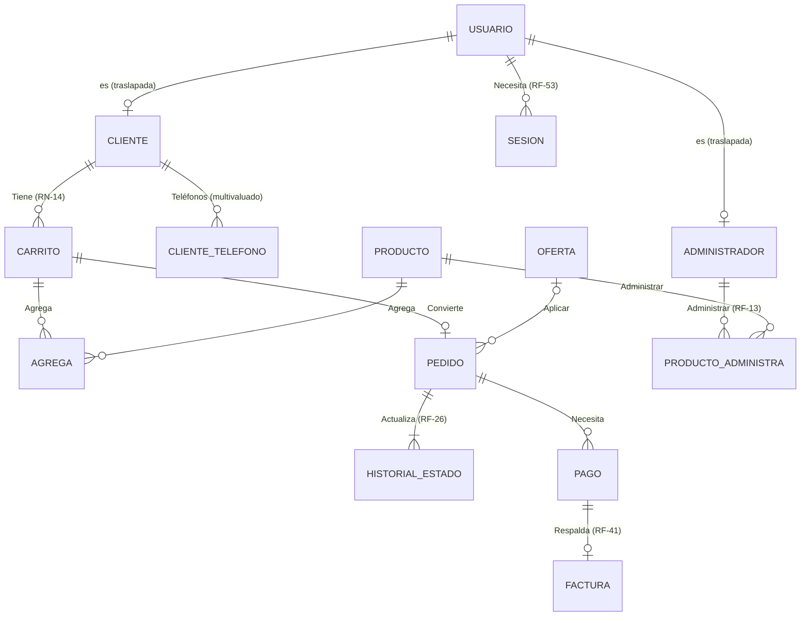

# Modelo de datos

**Proyecto:** DC Hobbies Cultura Geek Online · **Equipo:** Twenty One CoPilots
**Fuente de verdad:** las migraciones de `database/migraciones/`. El DDL completo se
genera con `npm run db:dump` en `database/schema.sql`.
**Documentos relacionados:** criterios de diseño en [`arquitectura.md`](arquitectura.md)
§ 9; diagrama EER actualizado en [`EER 21 CoPilots.drawio.xml`](EER%2021%20CoPilots.drawio.xml);
EER y mapeo del Sprint 0 al final de `documentos/requerimientos/sprint_0.pdf`.

Este documento cumple dos funciones que exige el curso: describir el modelo vigente
(diccionario de datos) y registrar **qué cambió respecto al Sprint 0 y por qué** (§ 4).

---

## 1. Visión general

La base de datos sigue el EER del equipo, con los ajustes de § 4. Tiene un esquema de
PostgreSQL por módulo del servidor (DD-11): solo el repositorio del módulo dueño
escribe en su esquema; las llaves foráneas entre esquemas sí se permiten.

| Esquema | Tablas | Migración |
|---|---|---|
| `usuarios` | `usuario`, `sesion` | `002_usuarios.sql` |
| `admin` | `administrador` | `003_admin.sql` |
| `clientes` | `cliente`, `cliente_telefono` | `004_clientes.sql` |
| `catalogo` | `producto` | `005_catalogo.sql` |
| `inventario` | `producto_administra` | `006_inventario.sql` |
| `pedidos` | `carrito`, `agrega`, `oferta`, `pedido`, `historial_estado` | `007_pedidos.sql` |
| `pagos` | `pago` | `008_pagos_facturacion.sql` |
| `facturacion` | `factura` | `008_pagos_facturacion.sql` |
| `reportes` | vistas `v_estado_pedido`, `v_venta_por_producto`, `v_existencias`, `v_pedidos_por_cliente`, `v_registro_mercancia` | `009_reportes.sql` |

En total son 14 tablas y 5 vistas. `001_esquemas_y_utilidades.sql` crea los esquemas y
las funciones de los triggers técnicos.

Convenciones: nombres en español, `snake_case` y sin tildes; **llaves naturales**
(el correo del usuario, el SKU del producto, el código de la oferta) y llaves
compuestas heredadas en las entidades débiles; montos en `NUMERIC(12,2)` dólares;
fechas en `TIMESTAMPTZ`; restricciones con nombre (`ck_…`, `ux_…`, `ix_…`) para que el
servidor pueda traducir cada error a un mensaje de negocio.

---

## 2. Diccionario de datos

Se listan las columnas con significado de negocio y las restricciones relevantes. El
detalle exacto está en las migraciones.

### 2.1 `usuarios`

`usuario` y `sesion` están en un esquema propio porque son de todos los usuarios,
clientes incluidos (C-14). Las escribe el módulo `admin`, que es el del inicio de
sesión.

**`usuario`** — cuentas para iniciar sesión (RF-50, RF-53).

| Columna | Descripción |
|---|---|
| `correo` | Llave primaria. Se guarda en minúsculas y sin espacios en los extremos (`ck_usuario_correo_normalizado`) |
| `contrasena` | Hash bcrypt; nunca la contraseña en texto plano (RNF-08) |
| `nombre` | Nombre para mostrar; no puede estar vacío |

El usuario no tiene columna de rol: es administrador si su correo está en
`admin.administrador`, cliente si está en `clientes.cliente`, o ambos (§ 2.2).

**`sesion`** — sesiones iniciadas (RF-53), entidad débil de `usuario`. El navegador
guarda el token en una cookie `HttpOnly`; aquí solo se guarda su hash (`token_hash`,
único en `ux_sesion_token`) junto con `fecha_creacion` y `fecha_vencimiento`, que debe
ser posterior a la creación. Una sesión es válida si `fecha_vencimiento` no ha pasado.
Si se borra el usuario, se borran sus sesiones.

### 2.2 `admin` y `clientes`

**`admin.administrador`** — especialización de `usuario` sin atributos propios. Su
llave es `correo_usuario`. Un índice único (`ux_administrador_unico`) impide que
exista más de una fila (RF-49).

**`clientes.cliente`** — especialización de `usuario` con los datos del comprador
(RF-33).

| Columna | Descripción |
|---|---|
| `correo_usuario` | Llave primaria y llave foránea a `usuario`: todo cliente tiene cuenta |
| `cedula` | Obligatoria y única (`ux_cliente_cedula`), porque la factura la exige (RN-18) |
| `direccion` | Dirección de entrega habitual; opcional |
| `num_compras` | Contador para la escala de fidelidad (RF-34); 0 o más. El nivel no se guarda: se deriva de este número |

En el EER, `direccion` y "Teléfonos" forman el atributo compuesto "Datos de
contacto" del cliente.

**`clientes.cliente_telefono`** — atributo multivaluado "Teléfonos" del EER. Llave
`(correo_usuario, telefono)`.

**Especialización traslapada.** En el EER la especialización de Usuario en
Administrador y Cliente está marcada con "O": un mismo correo puede estar en
`administrador` y en `cliente` a la vez.

### 2.3 `catalogo`

**`producto`**

| Columna | Descripción |
|---|---|
| `sku` | Llave primaria. Se guarda en mayúsculas y sin espacios en los extremos (RF-01, RF-59) |
| `nombre`, `descripcion`, `imagen`, `proveedor` | Datos generales; el nombre no puede estar vacío |
| `categoria` | Texto de un solo nivel, la "familia" de la hoja del cliente (RF-02). Indexada (`ix_producto_categoria`) |
| `item` | Costo del producto en dólares; 0 o más |
| `importacion` | Porcentaje por aranceles (RN-01); 0 o más |
| `costo_total` | **Columna generada**: `item × (1 + importacion / 100)`. Nunca contradice a sus partes |
| `margen_ganancia` | Porcentaje sobre el costo total; admite negativos para liquidación (RN-02), pero mayor que −100 |
| `tasa_impuesto` | Porcentaje de impuesto de venta, 13 por defecto (RES-06); entre 0 y 100 |
| `stock` | Existencias actuales; 0 o más (RN-13). Es la fila que se bloquea con `FOR UPDATE` al vender |
| `contrapedido` | Si se puede pedir aunque no haya stock (RN-03, RF-23) |

El **precio de venta no se guarda** (DD-13): lo calcula el motor de precios a partir
de `costo_total`, `margen_ganancia` y `tasa_impuesto`
([`formula-precio.md`](formula-precio.md)).

### 2.4 `inventario`

**`producto_administra`** — historial de entradas y salidas de mercancía que registra
el administrador (RF-13, RF-15). **Solo inserción** (RF-19).

| Columna | Descripción |
|---|---|
| `sku` | Producto que entra o sale |
| `correo_administrador` | Quién registró el movimiento; llave foránea a `admin.administrador` |
| `fecha` | Cuándo se registró. Forma parte de la llave `(sku, correo_administrador, fecha)` |
| `cantidad` | Con signo: positiva es una entrada y negativa una salida; nunca 0 |

El saldo vigente está en `catalogo.producto.stock`; esta tabla explica cómo se llegó a
él. Un error se corrige con otro registro de signo contrario.

### 2.5 `pedidos`

**`carrito`** — carrito persistente del cliente (RN-14, RF-24), entidad débil de
`cliente`.

| Columna | Descripción |
|---|---|
| `correo_cliente`, `num_carrito` | Llave primaria; `num_carrito` es mayor que 0 |
| `estado_carrito` | `activo` o `convertido`. Solo un carrito activo por cliente (`ux_carrito_activo_por_cliente`) |
| `fecha_creacion`, `fecha_actualizacion` | La segunda la mantiene un trigger |
| `fecha_cierre` | Cuándo se convirtió en pedido. Un `CHECK` exige que solo la tengan los carritos convertidos |

**`agrega`** — productos agregados a un carrito; son también las líneas del pedido.
Llave `(correo_cliente, num_carrito, sku)`.

| Columna | Descripción |
|---|---|
| `cantidad_solicitada` | Mayor que 0 |
| `precio_unitario` | Precio sin impuesto, fijado al agregar (RF-25). Un cambio posterior en el costo o el margen no lo altera |
| `tasa_impuesto_aplicada` | Tasa de impuesto que se le aplicó; entre 0 y 100 |

**`oferta`** — descuentos que define el administrador (aprobado #10, RN-08, RN-09).

| Columna | Descripción |
|---|---|
| `codigo_oferta` | Llave primaria, en mayúsculas y sin espacios en los extremos |
| `nombre`, `descripcion` | Para mostrar |
| `fecha_inicio`, `fecha_fin` | Vigencia; el fin no puede ser anterior al inicio |
| `porcentaje_descuento` | Mayor que 0 y hasta 100 |
| `monto_minimo` | Monto mínimo de compra para aplicarla; 0 o más |
| `nivel_fidelidad_minimo` | Nivel mínimo del cliente para aplicarla; mayor que 0 |

**`pedido`** — entidad débil de `carrito` (relación «Convierte», 1 a 0..1): hereda su
llave `(correo_cliente, num_carrito)`, que identifica al pedido (RF-30).

| Columna | Descripción |
|---|---|
| `fecha_pedido_realizado` | Cuándo se confirmó (RF-25) |
| `fecha_entrega` | Opcional; no puede ser anterior a la del pedido |
| `modalidad_entrega` | `mensajero`, `uber_flash`, `correos_cr` o `entrega_personal` (RF-62) |
| `direccion` | Dirección de entrega (RF-31) |
| `costo_entrega` | 0 o más (RF-62, RN-16) |
| `codigo_oferta` | Oferta aplicada, si hay una |

El pedido no guarda su estado ni sus montos: el estado sale del historial y los montos
de las líneas en `agrega`.

**`historial_estado`** — entidad débil de `pedido` (relación «Actualiza») con cada
cambio de estado (RF-26). **Solo inserción.** Su llave parcial es `estado`, así que la
llave es `(correo_cliente, num_carrito, estado)`: un pedido pasa por cada estado a lo
sumo una vez, lo que coincide con la máquina de estados, que no tiene ciclos (RN-15).
`estado` es `colocado`, `procesado`, `en_transito`, `finalizado` o `cancelado` (RF-28);
qué transición es legal lo decide el dominio. `fecha` es cuándo ocurrió el cambio. El
estado vigente es el del registro más reciente (`reportes.v_estado_pedido`).

### 2.6 `pagos` y `facturacion`

**`pagos.pago`** — cada intento de cobro de un pedido. Un pedido puede tener varios.

| Columna | Descripción |
|---|---|
| `num_referencia` | Llave primaria: la referencia que devuelve la pasarela |
| `fecha`, `monto` | El monto es 0 o más |
| `metodo_pago` | `tarjeta`, `sinpe_movil`, `efectivo`, `datafono` o `contra_entrega` |
| `estado_pago` | `pendiente`, `aprobado` o `rechazado` |
| `correo_cliente`, `num_carrito` | El pedido que se cobra; tiene que existir |

**`facturacion.factura`** — respalda un pago (RF-41); un pago tiene a lo sumo una
factura (`ux_factura_pago`). Guarda `num_factura` (llave), `fecha_emision` y
`num_referencia`. Solo se guarda una factura emitida. El subtotal, el impuesto, el
descuento y el total se derivan de las líneas del pedido.

**No existe ninguna columna para datos de tarjeta** (RNF-09).

### 2.7 `reportes`

| Vista | Uso |
|---|---|
| `v_estado_pedido` | Estado vigente de cada pedido: el último registro de su historial (RF-26, RF-27) |
| `v_venta_por_producto` | Ventas por producto y categoría, sin pedidos cancelados (RF-44, RF-45). Se filtra por `fecha_pedido_realizado` para el rango de fechas (RF-47) |
| `v_existencias` | Stock de cada producto con las entradas del precio; el precio lo calcula el servicio |
| `v_pedidos_por_cliente` | Pedidos de cada cliente con fecha, modalidad, oferta, subtotal, impuesto, costo de entrega y estado (RF-46) |
| `v_registro_mercancia` | Entradas y salidas de mercancía con su fecha y responsable (RF-19) |

---

## 3. Qué garantiza la base de datos y qué no

Según DD-10, la base de datos garantiza **integridad** y el dominio decide las
**reglas de negocio**.

Además de las restricciones de cada tabla, `npm run db:test` verifica invariantes que
cruzan varias tablas y que por eso garantiza el servicio y no un `CHECK`:

- todo pedido viene de un carrito convertido;
- todo pedido tiene al menos un producto;
- el historial de cada pedido empieza en `colocado` (RF-26);
- solo se factura un pago aprobado (RF-41).

La base de datos **no** decide:

- qué transiciones de estado del pedido son legales (RN-15);
- el precio de venta ni si una oferta aplica a un pedido (RN-01, RN-09);
- si un producto se muestra en el catálogo (RN-03);
- cuándo se dispara la alerta de existencias bajas (RN-04);
- si un cliente de cierto nivel puede pagar contra entrega (RN-11).

Todo eso vive en los servicios de `apps/server/`, con sus pruebas unitarias.

---

## 4. Cambios respecto al Sprint 0

El punto de partida es el EER y el mapeo del Sprint 0 (páginas finales del SRS). La
base de datos sigue ese EER; los cambios son los mínimos que pide algún requerimiento
y ya están en el diagrama actualizado (`EER 21 CoPilots.drawio.xml`). Los IDs
coinciden con los del documento del Sprint 1, § 3.2.

| ID | Cambio | Justificación | Requerimientos |
|---|---|---|---|
| C-01 | **Producto:** Precio Venta y Precio Impuesto ya no se guardan; los calcula el motor de precios. | Son atributos derivados. Si se guardan, quedan desactualizados cada vez que cambia el costo o el margen, y la fórmula estaba en discusión (INC-05). Con el motor solo hay un lugar que calcula el precio. | RN-01, RF-03 a RF-05, INC-05 |
| C-02 | **Producto:** Costo Total pasa a ser una columna generada (`item × (1 + importacion / 100)`) y se agrega `tasa_impuesto` (13 % por defecto). | En el EER, Costo Total es un atributo compuesto de Item e Importación; como columna generada nunca puede contradecir a sus partes. La tasa se guarda para que cada línea del carrito fije la que se le aplicó. | RN-01, RES-06 |
| C-03 | **Montos en dólares** en vez de colones. | El PO confirmó el 1 de octubre que la tienda maneja dólares, y la hoja del cliente trae la columna `costo_usd`. | RNF-17 |
| C-04 | **Categoría como texto, sin subcategoría.** | El SRS (RF-02) y HU-03 hablaban de categoría y subcategoría, pero el EER del Sprint 0 ya tenía Categoría como atributo simple y la hoja real del cliente solo trae la «familia». | RF-02, RF-10 |
| C-05 | **Carrito:** llave `(correo_cliente, num_carrito)` como entidad débil de Cliente; se agregan Estado carrito (`activo` / `convertido`) y Fecha cierre; solo un carrito activo por cliente. | El EER del Sprint 0 ya dibujaba Carrito como entidad débil («Tiene»), pero el mapeo usaba un `CarritoId` propio. También hace falta saber qué carrito ya se convirtió en pedido. | RN-14, RF-24 |
| C-06 | **Pedido** pasa a ser entidad débil de Carrito (relación «Convierte», 1 a 0..1) y hereda su llave. Se elimina `NumeroPedido` y la tabla `PEDIDO_PRODUCTO` («Incluye»): las líneas del pedido son las de Agrega. | Todo pedido en línea nace de un carrito, y tener las mismas líneas en dos tablas era duplicar datos. Las ventas de otros canales (RF-17) también pasan por un carrito. | RF-25, RF-30, RF-17 |
| C-07 | **Agrega** guarda Precio unitario (sin impuesto) y Tasa impuesto aplicada. | El precio que se cobra queda fijo en la línea: si después cambia el margen o el costo, los pedidos ya hechos no cambian. | RF-25, RF-51 |
| C-08 | Entidad nueva **Oferta** (relación «Aplicar» con Pedido): vigencia, porcentaje, monto mínimo y nivel de fidelidad mínimo. | En la entrevista del 24/09 (punto 10) el cliente pidió poder ajustar los descuentos sin cambiar el sistema. Reemplaza el monto mínimo fijo de RN-09. | RN-08, RN-09, aprobado #10 |
| C-09 | Entidad nueva **Factura** («Respalda»: un pago tiene 0 o 1 factura). Subtotal, impuestos, descuento y total son derivados. | El SRS pide factura por cada pago aprobado y el EER no la tenía. | RF-41, RN-18 |
| C-10 | Entidad nueva **Sesión**, débil de Usuario: hash del token, fecha de creación y de vencimiento. | El inicio de sesión usa una cookie con un token aleatorio. Guardar solo su hash permite validar la sesión en cada petición sin exponer tokens si alguien lee la tabla. | RF-53, RNF-08 |
| C-11 | **Producto_Administra** (relación «Gestiona/Administrar»): la cantidad va con signo (distinta de 0), la llave incluye la fecha y es de solo inserción. | Así sirve para entradas y salidas de mercancía, y es un historial que no se puede editar. | RF-13, RF-15, RF-19 |
| C-12 | Entidad débil **Historial del estado** (relación «Actualiza» con Pedido): llave parcial `estado` y atributo `fecha`; `CHECK` con los estados de RF-26 más `cancelado`, solo inserción. El estado del pedido se lee de la vista `v_estado_pedido`. | El estado ya era un atributo derivado en el EER del Sprint 0; ahora queda acotado a los estados del SRS, se sabe cuándo ocurrió cada cambio y su historial no se puede alterar. | RF-26, RF-28 |
| C-13 | **Implementación física** (no cambia el EER): un esquema de PostgreSQL por módulo, restricciones con nombre, correo y SKU normalizados, índice que permite un solo administrador, triggers de solo inserción y vistas para los reportes. | Alinea la base de datos con los módulos del servidor, hace verificables RF-19 y RF-49, y permite que el servidor traduzca cada error a un mensaje de negocio. | RF-19, RF-49, RNF-19 |
| C-14 | **Usuario** y **Sesión** van en un esquema propio, `usuarios`, en vez de `admin`, creadas en `002_usuarios.sql`. | Las cuentas y sus sesiones son de todos los usuarios, clientes incluidos. En `admin` hacían pensar que todo usuario era administrador. | RF-50, RF-53 |

### Lo que se conservó del prototipo

Las herramientas completas (migraciones con *checksum*, `reset`, `seed`, `dump`,
`new-migration`, `docker-compose.yml` y la guía) y varias ideas de modelado: el índice
único parcial para un solo carrito activo, el `CHECK` que liga el estado del carrito
con su fecha de cierre, el hash bcrypt de contraseñas y los productos de prueba que
cubren a propósito los casos del SRS.

---

## 5. Pendientes

Las decisiones abiertas que afectan al modelo (referencia de un pago sin respuesta de
la pasarela, usuarios que no son ni administrador ni cliente, bitácora, histórico de
costos, motivo de los ajustes, aceptación de términos, escala de fidelidad, datos
fiscales y cómo excluir un producto) están en
[`cambios-siguiente-sprint.md`](../requerimientos/cambios-siguiente-sprint.md). Cuando
se decida cada una, se agrega aquí su fila en § 4.

---

## 6. Cómo registrar un cambio al modelo

1. `npm run db:new -- descripcion` y escriba el SQL (nombres calificados por esquema).
2. Agregue aquí una fila en § 4 con el siguiente ID (`C-15`, …), el cambio, la
   justificación y los requerimientos que lo motivan. Si cambia una tabla, actualice
   también § 2.
3. Si la migración agrega una restricción, agregue su prueba en `database/pruebas/`.
4. Actualice el diagrama EER (`EER 21 CoPilots.drawio.xml`) y el mapeo.
5. Corra `npm run db:reset`, `npm run db:test` y `npm run db:dump`, e incluya todo en
   el mismo Pull Request.
