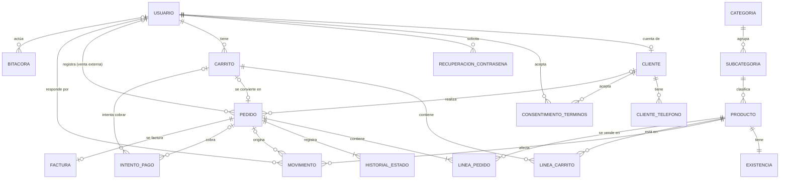

# Modelo de datos

**Proyecto:** DC Hobbies Cultura Geek Online · **Equipo:** Twenty One CoPilots
**Fuente de verdad:** las migraciones de `database/migraciones/`. El DDL completo se
genera con `npm run db:dump` en `database/schema.sql`.
**Documentos relacionados:** criterios de diseño en [`arquitectura.md`](arquitectura.md)
§ 9; EER y mapeo del Sprint 0 al final de `documentos/requerimientos/sprint_0.pdf`.

Este documento cumple dos funciones que exige el curso: describir el modelo vigente
(diccionario de datos) y registrar **qué cambió respecto al Sprint 0 y por qué** (§ 4).

---

## 1. Visión general

La base de datos tiene un esquema de PostgreSQL por módulo del servidor (DD-11). Solo
el repositorio del módulo dueño escribe en su esquema; las llaves foráneas entre
esquemas sí se permiten.

| Esquema | Tablas | Migración |
|---|---|---|
| `admin` | `usuario`, `sesion`, `recuperacion_contrasena`, `bitacora`, `parametro_negocio` | `002_admin.sql`, `009_sesion.sql` |
| `catalogo` | `categoria`, `subcategoria`, `producto` | `003_catalogo.sql` |
| `inventario` | `existencia`, `movimiento` | `004_inventario.sql` |
| `clientes` | `nivel_fidelidad`, `cliente`, `cliente_telefono`, `consentimiento_terminos` | `005_clientes.sql` |
| `pedidos` | `carrito`, `linea_carrito`, `pedido`, `linea_pedido`, `historial_estado` | `006_pedidos.sql` |
| `pagos` | `intento_pago` | `007_pagos_facturacion.sql` |
| `facturacion` | `factura` | `007_pagos_facturacion.sql` |
| `reportes` | vistas `v_venta_por_linea`, `v_existencias`, `v_pedidos_por_cliente`, `v_historico_costos` | `008_reportes.sql` |

Convenciones: nombres en español, `snake_case` y sin tildes; llaves primarias
numéricas (`GENERATED ALWAYS AS IDENTITY`); montos en `NUMERIC(12,2)` colones;
fechas en `TIMESTAMPTZ`; restricciones con nombre (`ck_…`, `ux_…`, `ix_…`, `fk_…`)
para que el servidor pueda traducir cada error a un mensaje de negocio.

---

## 2. Diccionario de datos

Se listan las columnas con significado de negocio y las restricciones relevantes. Las
columnas `id`, `creado_en` y `actualizado_en` se omiten salvo que tengan algo
particular. El detalle exacto está en las migraciones.

### 2.1 `admin`

**`usuario`** — cuentas para iniciar sesión (RF-50, RF-53).

| Columna | Descripción |
|---|---|
| `correo` | Correo de inicio de sesión. Único sin distinguir mayúsculas (`ux_usuario_correo`) |
| `contrasena_hash` | Hash bcrypt; nunca la contraseña en texto plano (RNF-08) |
| `rol` | `administrador` o `cliente` (RF-50). Solo puede existir un administrador (`ux_usuario_administrador_unico`, RF-49) |
| `activo` | Permite desactivar una cuenta sin borrarla |

**`sesion`** — sesiones iniciadas (RF-53). El navegador guarda el token en una cookie
`HttpOnly`; aquí solo se guarda su hash (`token_hash`, único) junto con `usuario_id` y
`vence_en`. Una sesión es válida si `vence_en` no ha pasado y la cuenta está activa.

**`recuperacion_contrasena`** — enlaces de restablecimiento (RF-54). Guarda el hash
del token (`token_hash`, único), `vence_en` y `usado_en`. Un enlace es válido si
`usado_en` es nulo y `vence_en` no ha pasado.

**`bitacora`** — operaciones sensibles e intentos de acceso denegados (RF-52,
RNF-10). **Solo inserción.**

| Columna | Descripción |
|---|---|
| `usuario_id` | Quién actuó; nulo en un intento anónimo |
| `accion` | Qué pasó: `cambio_margen`, `ajuste_existencias`, `cancelacion_pedido`, `acceso_denegado`… |
| `entidad`, `entidad_id` | Sobre qué registro |
| `valor_anterior`, `valor_nuevo` | `JSONB` con los valores antes y después |

**`parametro_negocio`** — valores de negocio editables por el administrador
(aprobado #10). Clave–valor con descripción. Claves iniciales:
`monto_minimo_descuento`, `emisor_razon_social`, `emisor_cedula_juridica`,
`version_terminos_vigente`.

### 2.2 `catalogo`

**`categoria`** y **`subcategoria`** — los dos niveles fijos del SRS (RF-02). Nombres
únicos sin distinguir mayúsculas ni espacios en los extremos.

**`producto`**

| Columna | Descripción |
|---|---|
| `sku` | Código del producto. Se guarda normalizado (mayúsculas, sin espacios en los extremos) y es único (RF-01, RF-59) |
| `costo_item` | Costo vigente para calcular el precio. El histórico está en `inventario.movimiento` |
| `porcentaje_importacion` | Porcentaje por aranceles (RN-01). No negativo |
| `margen_ganancia` | Porcentaje; admite negativos para liquidación (RN-02), pero mayor que -100 |
| `admite_contrapedido` | Si puede venderse sin existencias (RN-03, RN-13) |
| `estado` | `activo` o `descontinuado`: baja lógica, nunca se borra (RF-18) |
| `fecha_retiro` | Retiro programado de productos de temporada (RF-09) |

El **precio de venta no se guarda** (DD-13): lo calcula el motor de precios a partir
de `costo_item`, `porcentaje_importacion`, `margen_ganancia` y el impuesto.

### 2.3 `inventario`

**`existencia`** — saldo actual por producto; es la fila que se bloquea con
`FOR UPDATE` al vender (§ 7.3 de arquitectura). `cantidad >= 0`.

**`movimiento`** — libro de todos los cambios de existencias (RF-15). **Solo
inserción** (RF-19).

| Columna | Descripción |
|---|---|
| `tipo` | `carga_inicial`, `ingreso`, `venta`, `cancelacion`, `ajuste`, `reposicion` |
| `cantidad` | Con signo: positiva en `carga_inicial`, `ingreso` y `cancelacion`; negativa en `venta` y `reposicion`; cualquiera distinta de cero en `ajuste` |
| `costo_unitario` | Obligatorio en `carga_inicial` e `ingreso`, nulo en los demás. Es el histórico de costos (RN-06, RF-14) |
| `motivo`, `responsable_id` | Obligatorios en `ajuste` (RF-20) |
| `pedido_id` | Obligatorio en `venta` y `cancelacion`; prohibido en entradas y ajustes; opcional en `reposicion` |

**Invariante:** para cada producto, `existencia.cantidad` es igual a la suma de sus
movimientos. `npm run db:test` lo verifica.

### 2.4 `clientes`

**`nivel_fidelidad`** — escala editable (RN-08, RN-09): `nivel`, `compras_minimas`
(único) y `porcentaje_descuento` (0 a 100). El nivel de un cliente no se guarda: es el
mayor nivel cuyo `compras_minimas` no supera su `num_compras`.

**`cliente`** — datos del comprador (RF-33).

| Columna | Descripción |
|---|---|
| `usuario_id` | Cuenta de inicio de sesión, opcional: un cliente de otro canal (RF-17) o importado (RF-60) no la tiene |
| `correo` | Correo de contacto, único |
| `tipo_cedula`, `cedula` | `fisica` o `juridica`; la cédula es obligatoria y única (RN-18) |
| `num_compras` | Contador para la escala de fidelidad (RF-34) |

**`cliente_telefono`** — atributo multivaluado "Teléfonos" del EER.

**`consentimiento_terminos`** — aceptación de términos con fecha y versión (RF-38).
Pertenece a un usuario, a un cliente o a ambos. **Solo inserción.**

### 2.5 `pedidos`

**`carrito`** — carrito persistente de una cuenta (RN-14, RF-24). `estado` es
`activo` o `convertido`; solo un carrito activo por cuenta
(`ux_carrito_activo_por_usuario`). **No guarda precios.**

**`linea_carrito`** — producto y cantidad (> 0) dentro del carrito.

**`pedido`**

| Columna | Descripción |
|---|---|
| `id` | Identificador único del pedido (RF-30) |
| `canal` | `en_linea`, `presencial` o `redes_sociales` (RN-05, RF-17) |
| `cliente_id` | Obligatorio en línea; opcional en otros canales |
| `carrito_id` | Carrito de origen, si lo hay; solo en pedidos en línea |
| `registrado_por` | Administrador que registra una venta de otro canal; obligatorio fuera de línea |
| `estado` | `colocado`, `procesado`, `en_transito`, `finalizado` (RF-26) o `cancelado` (RF-28). Qué transición es legal lo decide el dominio |
| `estado_pago` | `pendiente`, `pagado` o `pendiente_cobro` (contra entrega, RF-69) |
| `modalidad_entrega` | `mensajero`, `uber_flash`, `correos_cr`, `entrega_personal` (RF-62); obligatoria en línea |
| `direccion_entrega`, `numero_guia` | RF-31, RF-63 |
| `subtotal`, `descuento`, `impuesto`, `costo_envio`, `total` | Copia fija de los montos al confirmar |

**`linea_pedido`** — producto, `cantidad`, `cantidad_contrapedido` (entre 0 y
`cantidad`; no descuenta existencias) y `precio_unitario` sin impuesto vigente al
confirmar. **Solo inserción.**

**`historial_estado`** — cada transición con su fecha y quién la hizo (RF-26). **Solo
inserción.** El estado vigente está en `pedido.estado`; el servicio escribe ambos en
la misma transacción, y `npm run db:test` verifica que coincidan. La fecha de entrega
es la del registro `finalizado`.

### 2.6 `pagos` y `facturacion`

**`intento_pago`** — cada intento de cobro. Se refiere a un pedido, a un carrito o a
ambos: un pago rechazado no crea pedido (RF-39). `metodo`: `tarjeta`, `sinpe_movil`,
`efectivo`, `datafono`, `contra_entrega`. `resultado`: `pendiente`, `aprobado`,
`rechazado`, `no_disponible`. `resuelto_en` es la fecha de resolución (RF-40) y es
obligatoria salvo en `pendiente`. `referencia_externa` es nula si la pasarela no
respondió (RNF-06).

**`factura`** — una por pedido (RF-41). Guarda una copia de los datos fiscales del
emisor y del receptor y de los montos (RN-18). `estado`: `pendiente`, `emitida`,
`rechazada`; una factura emitida tiene `consecutivo` y `emitida_en`. Sus líneas son
las de `linea_pedido`.

### 2.7 `reportes`

| Vista | Uso |
|---|---|
| `v_venta_por_linea` | Ventas de todos los canales por producto y familia, sin pedidos cancelados (RF-44). Se filtra por `colocado_en` para el rango de fechas (RF-47) |
| `v_existencias` | Existencias vigentes con costo y entradas del precio (RF-45); el precio lo calcula el servicio |
| `v_pedidos_por_cliente` | Pedidos de cada cliente con fecha, monto y estado (RF-46) |
| `v_historico_costos` | Ingresos con su costo (RN-06, RF-14) |

---

## 3. Qué garantiza la base de datos y qué no

Según DD-10, la base de datos garantiza **integridad** y el dominio decide las
**reglas de negocio**. En concreto, la base de datos **no** decide:

- qué transiciones de estado del pedido son legales (RN-15);
- el precio de venta ni el descuento aplicable (RN-01, RN-09);
- si un producto se muestra en el catálogo (RN-03);
- cuándo se dispara la alerta de existencias bajas (RN-04);
- si un cliente de cierto nivel puede pagar contra entrega (RN-11).

Todo eso vive en los servicios de `apps/server/`, con sus pruebas unitarias.

---

## 4. Cambios respecto al Sprint 0

El punto de partida es el EER y el mapeo del Sprint 0 (páginas finales del SRS) y el
EER actualizado que tradujo el prototipo `kit-bd-21copilots_4`. Estos cambios se
acordaron al revisar el prototipo contra el SRS y el documento de arquitectura. **El
diagrama EER y el mapeo deben actualizarse para reflejarlos.**

| ID | Cambio | Justificación | Requerimientos |
|---|---|---|---|
| M-01 | **Usuario con llave numérica**; el correo pasa a ser un atributo único. | Con el correo como llave, cambiarlo arrastra `ON UPDATE CASCADE` por carrito, pedido y pago, y un dato personal queda como identificador en todas las tablas. | RES-05, RF-53 |
| M-02 | La especialización Usuario → Administrador / Cliente se reemplaza por una columna `rol` en `usuario` y una entidad **Cliente con cuenta opcional**. | El administrador no tiene atributos propios. El cliente sí debe poder existir sin cuenta: compradores de otros canales y clientes importados. RF-49 se garantiza con un índice único parcial. | RF-17, RF-49, RF-50, RF-60 |
| M-03 | Cliente agrega `nombre`, `correo` de contacto y `tipo_cedula`. | Sin cuenta, el cliente necesita sus propios datos de contacto; la factura distingue cédula física y jurídica. | RF-33, RN-18 |
| M-04 | **Producto:** `PrecioVenta` y `PrecioImpuesto` no se guardan; tampoco `Stock`. Se agregan `estado` (baja lógica) y `fecha_retiro`. El SKU se guarda normalizado. | El precio lo calcula el motor de precios (INC-05). Las existencias pasan a `inventario.existencia`, que es la fila que se bloquea. Excluir un producto no puede borrar su historial. | RN-01, INC-05, RF-01, RF-09, RF-18, RES-07 |
| M-05 | `Categoria` (texto libre) pasa a las tablas **Categoría** y **Subcategoría**. | El SRS pide dos niveles configurables; con texto libre no se pueden listar ni filtrar de forma confiable. (Propuesta C-01 del prototipo.) | RF-02, RF-10 |
| M-06 | `PRODUCTO_ADMINISTRA` pasa a **Movimiento de inventario** con tipo, cantidad con signo, costo, motivo, responsable y pedido. Solo inserción. | La relación original solo registraba entradas del administrador: no cubría ventas, cancelaciones, ajustes con motivo ni reposiciones, y se podía editar. El costo de cada ingreso forma el histórico de costos. | RF-13 a RF-20, RF-42, RN-06 |
| M-07 | **Carrito** pertenece a la cuenta, no guarda precios y tiene estados `activo` y `convertido`, con un solo carrito activo por cuenta. | El carrito se conserva indefinidamente: un precio fijado al agregar quedaría viejo. | RN-14, RF-24, RF-51 |
| M-08 | **Pedido como entidad fuerte** con sus propias líneas (`PEDIDO_PRODUCTO` → `linea_pedido`), como en el EER del Sprint 0. Se revierte el cambio del EER actualizado que lo hacía entidad débil del carrito. Se agregan `canal`, `registrado_por`, `estado`, `estado_pago`, `numero_guia` y los montos. | Una venta presencial no tiene carrito. Las líneas del pedido deben ser inmutables y llevar el precio vigente al confirmar. El pedido necesita su propio identificador. | RF-17, RF-25, RF-30, RF-40, RF-63, RN-05 |
| M-09 | `FechaEntrega` de Pedido se deriva del historial (registro `finalizado`). | Evita dos fuentes para el mismo dato. | RF-26 |
| M-10 | **Historial de estado** con llave propia y `CHECK` de los estados de RF-26 más `cancelado`; registra quién hizo el cambio. Solo inserción. | Un pedido podría repetir un estado; la llave propia lo permite. Los estados quedan acotados a los del SRS. | RF-26, RF-28 |
| M-11 | `PAGO` pasa a **Intento de pago**, que se refiere a un pedido o a un carrito, con referencia externa opcional y fecha de resolución. | Un pago rechazado no crea pedido; si la pasarela no responde no hay referencia y el intento debe registrarse igual. | RF-39, RF-40, RNF-06 |
| M-12 | **Factura** se asocia al pedido (no al pago) y guarda una copia de los datos fiscales y de los montos. | La factura corresponde al pedido pagado; una factura emitida no puede cambiar si después cambian los datos. | RF-41, RN-18 |
| M-13 | Se elimina **Oferta** (del EER actualizado). | Modelaba cupones (RF-66), que el SRS tiene en suspenso con prioridad W. El descuento confirmado es por nivel. | RF-66, RN-09 |
| M-14 | Entidades nuevas: **Nivel de fidelidad**, **Parámetro de negocio**, **Bitácora**, **Recuperación de contraseña** y **Consentimiento de términos**. | Requerimientos sin representación en el EER. | RN-08, RN-09, aprobado #10, RF-38, RF-52, RF-54, RNF-10 |
| M-15 | Un **esquema de PostgreSQL por módulo** y triggers que rechazan la modificación de registros históricos. | Alinea la base de datos con la arquitectura por módulos (DD-11) y hace verificable RF-19 (DD-16). | RF-19, RNF-19 |
| M-16 | Entidad nueva **Sesión** (`admin.sesion`, migración 009). | El inicio de sesión usa una cookie con un token aleatorio; la base de datos guarda solo su hash y el vencimiento, para poder validar la sesión en cada petición sin exponer tokens si se filtra la tabla. | RF-53, RNF-08 |

### Lo que se conservó del prototipo

Las herramientas completas (migraciones con *checksum*, `reset`, `seed`, `dump`,
`new-migration`, `docker-compose.yml` y la guía) y varias ideas de
modelado: el índice único parcial para un solo carrito activo, el `CHECK` que liga el
estado del carrito con su fecha de cierre, la baja lógica de productos, las tablas de
categoría y subcategoría, el hash bcrypt de contraseñas y los productos de prueba que
cubren a propósito los casos del SRS.

---

## 5. Pendientes

- **Actualizar el EER y el mapeo** (`EER 21 CoPilots.drawio`) con los cambios de § 4.
- **Fórmula de precio (INC-05):** las semillas usan la provisional de RN-01; el
  esquema no depende de ella.
- **Porcentajes de descuento (RN-09 a RN-11, en conflicto):** se ajustan editando
  `clientes.nivel_fidelidad`, sin migración.
- **Datos fiscales de la sociedad:** `admin.parametro_negocio` los tiene como
  "POR DEFINIR".
- **Tarifas de envío (DEP-07):** cuando se definan, se agrega una tabla en una
  migración nueva.

---

## 6. Cómo registrar un cambio al modelo

1. `npm run db:new -- descripcion` y escriba el SQL (nombres calificados por esquema).
2. Agregue aquí una fila en § 4 con el siguiente ID (`M-16`, …), el cambio, la
   justificación y los requerimientos que lo motivan. Si cambia una tabla, actualice
   también § 2.
3. Si la migración agrega una restricción, agregue su prueba en `database/pruebas/`.
4. Actualice el diagrama EER y el mapeo.
5. Corra `npm run db:reset`, `npm run db:test` y `npm run db:dump`, e incluya todo en
   el mismo Pull Request.
